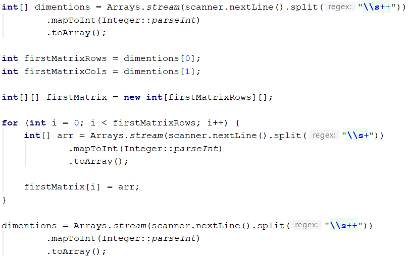
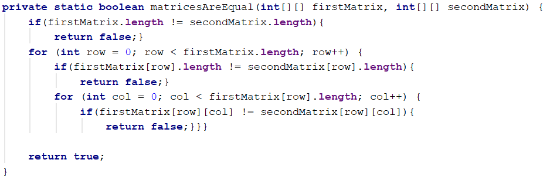
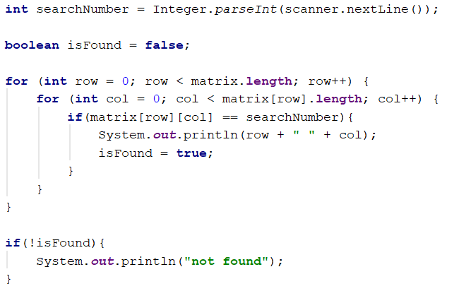
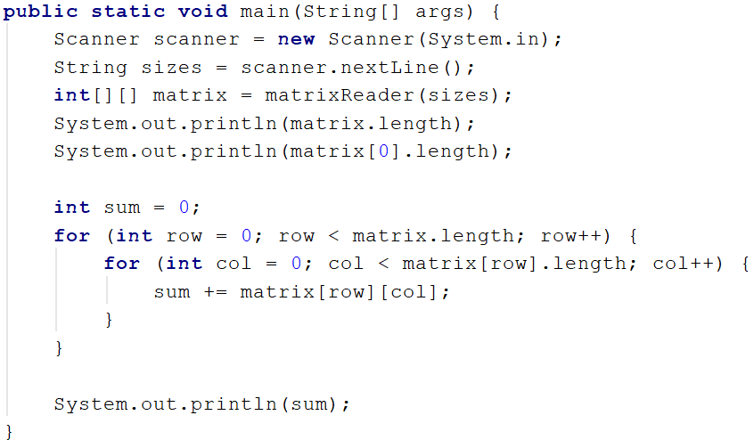

# Lab: Linear Data Structures

This document defines the exercises for "Java Advanced" course @ Software University. Please submit your solutions (source code) of all below described problems in Judge.

## I. Multidimensional Arrays

### 1. Compare Matrices

Write a program that reads two integer matrices (2D arrays) from the console and compares them element by element. For better code reusability, you could do the comparison in a method, which returns true if they are equal and false if not.
Each matrix definition on the console will contain a line with a positive integer number R – the number of rows in the matrix and C – the number of columns – followed by R lines containing the C numbers, separated by spaces (each line will have an equal amount of numbers.
The matrices will have at most 10 rows and at most 10 columns.
Print equal if the matrices match, and not equal if they don’t match.

### Examples

|Input|	Output|
|:-----|:-------|
|2 3 1 2 3 2 1 3 2 3 1 2 3 2 1 3|equal|
|2 3 1 2 3 4 5 6 2 2 1 3 4 5|not equal|

Read matrix:

Compare method:

<b>Solution: <a href="./Ex01CompareMatrices.java">Ex01CompareMatrices.java</a></b>

 
### 2. Positions Of

Write a program that reads a matrix of integers from the console, then a number and prints all the positions at which that number appears in the matrix.
The matrix definition on the console will contain a line with two positive integer numbers R and C – the number of rows and columns in the matrix – followed by R lines, each containing C numbers (separated by spaces), representing each row of the matrix.
The number you will need to find the positions of will be entered on a single line, after the matrix.
You should print each position on a single line – first print the row, then the column at which the number appears.
If the number does not appear in the matrix, print not found

### Examples

|Input|	Output|
|:-----|:-------|
|2 3 1 2 3 4 2 2 2|0 1 1 1 1 2 2 3|
|1 -2 -3 4 -5 6 5|not found|

### Hint:

1. Read matrix – look Problem 01
2. Find position:

<b>Solution: <a href="./Ex02PositionOf.java">Ex02PositionOf.java</a></b>

### 3. Intersection of Two Matrices

Write a program that reads two char matrices (A[][] and B[][]) of the same order M * N and prints third matrix C[][] which is filled with the intersecting elements of A and B, otherwise set the element to '*'. On the first two lines you receive M and N, then on 2 * M lines N characters – the matrices elements. 
The matrix elements may be any ASCII char except '*'.

### Examples

|Input|	Output|
|:-----|:-------|
|3 4 a b c d a b c d a b c d k b c k a b g d a k c d|* b c * a b * d a * c d|

<b>Solution: <a href="./Ex03IntersectionOfTwoMatrices.java">Ex03IntersectionOfTwoMatrices.java</a></b>

### 4. Sum Matrix Elements

Write a program that reads a matrix from the console and prints:
- The count of rows
- The count of columns
- The sum of all matrix’s elements
On the first line you will get the dimensions of the matrix in format {rows, columns}. On the next lines you will get the elements for each row separated with a coma.

### Examples

|Input|Output|
|:-----|:-------|
|3, 6 7, 1, 3, 3, 2, 1 1, 3, 9, 8, 5, 6 4, 6, 7, 9, 1, 0|3 6 76|

### Hint:

<b>Solution: <a href="./Ex04SumMatrixElements.java">Ex04SumMatrixElements.java</a></b>

 
### 5. Maximum Sum of 2x2 Submatrix

Write a program that reads a matrix from the console. Then find the biggest sum of a 2x2 submatrix. Print the submatrix and its sum.
On the first line you will get the dimensions of the matrix in format {rows, columns}. On the next lines you will get the elements for each row separated with a coma.

### Examples

|Input|Output|
|:-----|:-------|
|3, 6 7, 1, 3, 3, 2, 1 1, 3, 9, 8, 5, 6 4, 6, 7, 9, 1, 0|9 8 7 9 33|
|2, 4 10, 11, 12, 13 14, 15, 16, 17|12 13 16 17 58|

<b>Solution: <a href="./Ex05MaximumSumOf2x2SubMatrix.java">Ex05MaximumSumOf2x2SubMatrix.java</a></b>

### 6.	Print Diagonals of Square Matrix

Write a program that reads a matrix from the console. Then print the diagonals. The matrix will always be square. On the first line you read a single integer N the matrix size. Then on each line N elements. The first diagonal should always start with the element at the first row and col, the second diagonal should start with the element at the last row and first col.

### Examples

|Input|Output|
|:-----|:-------|
|3 1 2 3 1 2 3 1 2 3|1 2 3 1 2 3|
|4 1 2 3 2 1 1 2 4 1 2 1 4 2 2 3 1|1 1 1 1 2 2 2 2|

<b>Solution: <a href="./Ex06PrintDiagonals.java">Ex06PrintDiagonals.java</a></b>

### 7.** Find The Real Queen

Write a program that reads (8 x 8) matrix of characters from the console. The matrix represents a chess board with figures on it. The figures can be - queens as char 'q' or any other ASCII symbol. There will be more than one queen but only one queen will have valid position, which is not attacked from any other queen and does not attack any other queen. In other word in the way of the valid queen there are no other queens, but there may be any other ASCII symbol. Your task is to read the chessboard and find the position of the valid queen. According to chess rules the queen can attack all the cells in horizontal vertical and both diagonals which cross the queen position.

### Examples

|Input|Output|
|:-----|:-------|
|p a p a p a p a p a p a p a p a p a q a p a q a p a p a p a p a p a p q p a p a p a p a p a p a p a q a p a q a p a p a p a p a|4 3|
|1 q q q 1 q q q q 1 q q 1 q q 1 q q 1 q 1 q 1 q q q q 1 1 1 q q 1 1 1 1 q 1 1 1 q q q 1 1 1 q q q q 1 q 1 q 1 q q 1 q q 1 q q 1|4 4|

<b>Solution: <a href="./Ex07FindTheRealQueen.java">Ex07FindTheRealQueen.java</a></b>

### 8. Wrong Measurements

You will be given the rows of a matrix. Then the matrix itself. Inside this matrix there are mistaken values which need to be replaced you will receive the wrong value at the last line. Those values should be replaced with the sum of the nearest elements in the four directions up, down, left and right, but only if they are valid values. At the end you have to print the fixed measurements. 

### Examples

|Input|Output|
|:-----|:-------|
|3 1 2 4 4 6 7 8 9 4 1 0|1 2 9 15 6 7 8 9 16|
|3 1 2 4 4 4 6 4 3 8 9 4 2 1 0|1 2 2 3 15 6 6 3 8 9 9 2|

<b>Solution: <a href="./Ex08WrongMeasurements.java">Ex08WrongMeasurements.java</a></b>

<b>Document with tasks description: <a href="../../resources/L05MultidimensionalArrays/02. Java-Advanced-MultidimensionalArrays-Lab.docx">02. Java-Advanced-MultidimensionalArrays-Lab.docx</a></b>
