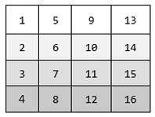
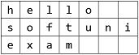
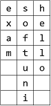
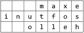
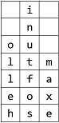

# **Multidimensional Arrays - Exercises**

This document defines the exercises for "Java Advanced" course @ Software University. Please submit your solutions (source code) of all below described problems in Judge.

## **Matrices:**

### **1. Fill the Matrix**
Filling a matrix in the regular way (top to bottom and left to right) is boring. Write two methods that fill a matrix of size N x N in two different patterns.

### **Examples**

|Pattern A|Pattern B|
|:-----|:-------|
|||

|Input|	Output|
|:-----|:-------|
|3, A|1 4 7 2 5 8 3 6 9|
|3, B|1 6 7 2 5 8 3 4 9|

### **Hints**

- Make a different method for each pattern
- Make a method for printing the matrix

### **2. Matrix of Palindromes**

Write a program to generate the following matrix of palindromes of 3 letters with r rows and c columns like the one in the examples below.
- Rows define the first and the last letter: row 0  ‘a’, row 1  ‘b’, row 2  ‘c’, …
- Columns + rows define the middle letter: 
  - column 0, row 0 -> ‘a’, column 1, row 0 -> ‘b’, column 2, row 0 -> ‘c’, …
  - column 0, row 1 -> ‘b’, column 1, row 1 -> ‘c’, column 2, row 1 -> ‘d’, …

### **Input**

- The numbers r and c stay at the first line at the input.
- r and c are integers in the range [1…26].
- r + c ≤ 27

### **Examples**

Input|	Output|
|:-----|:-------|
|4 6|aaa aba aca ada aea afa bbb bcb bdb beb bfb bgb ccc cdc cec cfc cgc chc ddd ded dfd dgd dhd did|
|3 2|aaa aba bbb bcb ccc cdc|

### **Hints**

- Use two nested loops to generate the matrix.
- Print the matrix row by row in a loop.
- Don’t forget to pack everything in methods.

### **3. Diagonal Difference**

Write a program that finds the difference between the sums of the square matrix diagonals (absolute value).

 
### **Input**

- The first line holds a number n – the size of matrix.
- The next n lines hold the values for every row – n numbers separated by a space.

### **Examples**

Input|Output|Comments|
|:-----|:-------|:-------|
|3 11 2 4 4 5 6 10 8 -12|15|Primary diagonal: sum = 11 + 5 + (-12) = 4 Secondary diagonal: sum = 4 + 5 + 10 = 19 Difference: Abs(4 - 19) = 15|

### **Hints**

- Use a single loop i = [1 … n] to sum the diagonals.
- The primary diagonal holds all cells {row, col} where row == col == i.
- The secondary diagonal holds all cells {row, col} where row == i and col == n-1-i.

### **4. Maximal Sum**

Write a program that reads a rectangular integer matrix of size N x M and finds in it the square 3 x 3 that has maximal sum of its elements. 

### **Input**

- On the first line, you will receive the rows N and columns M. 
- On the next N lines you will receive each row with its elements.

Print the elements of the 3 x 3 square as a matrix, along with their sum. See the format of the output below:

### **Examples**

Input|Output|Comments|
|:-----|:-------|:-------|
|4 5 1 5 5 2 4 2 1 4 14 3 3 7 11 2 8 4 8 12 16 4|Sum = 75 1 4 14 7 11 2 8 12 16||	 

### **5. Matrix shuffling**

Write a program which reads a string matrix from the console and performs certain operations with its elements. User input is provided in a similar way like in the problems above – first you read the dimensions and then the data. 
Your program should then receive commands in format: "swap row1 col1 row2c col2" where row1, row2, col1, col2 are coordinates in the matrix. In order for a command to be valid, it should start with the "swap" keyword along with four valid coordinates (no more, no less). You should swap the values at the given coordinates (cell [row1, col1] with cell [row2, col2]) and print the matrix at each step (thus you'll be able to check if the operation was performed correctly). 
If the command is not valid (doesn't contain the keyword "swap", has fewer or more coordinates entered or the given coordinates do not exist), print "Invalid input!" and move on to the next command. Your program should finish when the string "END" is entered.

### **Examples**

Input|Output|
|:-----|:-------|
|2 3 1 2 3 4 5 6 swap 0 0 1 1 swap 10 9 8 7 swap 0 1 1 0 END|5 2 3 4 1 6 Invalid input! 5 4 3 2 1 6|
|1 2 Hello World 0 0 0 1 swap 0 0 0 1 swap 0 1 0 0 END|Invalid input! World Hello Hello World|

### **Hints**

- Think about Exception Handling 

### **6. String Matrix Rotation**

You are given a sequence of text lines. Assume these text lines form a matrix of characters (pad the missing positions with spaces to build a rectangular matrix). Write a program to rotate the matrix by 90, 180, 270, 360, … degrees. Print the result at the console as sequence of strings after receiving the “END” command.

### **Examples**

|Input|Rotate(90)|Rotate(180)|Rotate(270)|
| --- | --- | --- | --- |
|hello softuni exam END ||||
 			
Input
The input is read from the console:
•	The first line holds a command in format "Rotate(X)" where X are the degrees of the requested rotation.
•	The next lines contain the lines of the matrix for rotation.
•	The input ends with the command "END".
The input data will always be valid and in the format described. There is no need to check it explicitly.
Output
Print at the console the rotated matrix as a sequence of text lines.
Constraints
•	The rotation degrees is positive integer in the range [0…90000], where degrees is multiple of 90.
•	The number of matrix lines is in the range [1…1 000].
•	The matrix lines are strings of length 1 … 1 000.
•	Allowed working time: 0.2 seconds. Allowed memory: 16 MB.
Examples
Input	Output		Input	Output		Input	Output
Rotate(90)
hello
softuni
exam
END	esh
xoe
afl
mtl
 uo
 n 
 i 		Rotate(180)
hello
softuni
exam
END	   maxe
inutfos
  olleh		Rotate(270)
hello
softuni
exam
END	 i 
 n 
ou 
ltm
lfa
eox
hse

Input	Output		Input	Output		Input	Output
Rotate(720)
js
exam
END	js
exam
		Rotate(810)
js
exam
END	ej
xs
a
m		Rotate(0)
js
exam
END	js
exam

7.	Crossfire 
You will receive two integers which represent the dimensions of a matrix. Then, you must fill the matrix with increasing integers starting from 1, and continuing on every row, like this:
first row: 1, 2, 3, …, n
second row: n + 1, n + 2, n + 3, …, n + n
third row: 2 * n + 1, 2 * n + 2, …, 2 * n + n
You will also receive several commands in the form of 3 integers separated by a space. Those 3 integers will represent a row in the matrix, a column and a radius. You must then destroy the cells which correspond to those arguments cross-like.
Destroying a cell means that, that cell becomes completely nonexistent in the matrix. Destroying cells cross-like means that you form a cross figure with center point - equal to the cell with coordinates – the given row and column, and lines with length equal to the given radius. See the examples for more info. 
The input ends when you receive the command “Nuke it from orbit”. When that happens, you must print what has remained from the initial matrix.
Input
•	On the first line you will receive the dimensions of the matrix. You must then fill the matrix according to those dimensions
•	On the next several lines you will begin receiving 3 integers separated by a single space, which represent the row, col and radius. You must then destroy cells according to those coordinates
•	When you receive the command “Nuke it from orbit” the input ends
Output
•	The output is simple. You must print what is left from the matrix
•	Every row must be printed on a new line and every column of a row - separated by a space
Constraints
•	The dimensions of the matrix will be integers in the range [2, 100]
•	The given rows and columns will be valid integers in the range [-231 + 1, 231 - 1]
•	 The radius will be in range [0, 231 - 1]
•	Allowed time/memory: 250ms/16MB
Examples
Input	Output	Comment
5 5
3 3 2
4 3 2
Nuke it from orbit	1 2 3 4 5
6 7 8 10
11 12 13
16
21	Initial matrix:
1  2  3  4  5
6  7  8  9  10
11 12 13 14 15
16 17 18 19 20
21 22 23 24 25
Result from first destruction:
1  2  3  4  5
6  7  8  10
11 12 13 15
16           
21 22 23 25
Result from second destruction:
1  2  3  4  5
6  7  8  10
11 12 13
16
21

5 5
4 4 4
Nuke it from orbit	1 2 3 4
6 7 8 9
11 12 13 14
16	7 18 19	

8.	The Heigan Dance
At last, level 80. And what do level eighties do? Go raiding. This is where you are now – trying not to be wiped by the famous dance boss, Heigan the Unclean. The fight is pretty straightforward - dance around the Plague Clouds and Eruptions, and you’ll be just fine.
Heigan’s chamber is a 15-by-15 two-dimensional array. The player always starts at the exact center. For each turn, Heigan uses a spell that hits a certain cell and the neighboring rows/columns. For example, if he hits (1,1), he also hits (0,0, 0,1, 0,2, 1,0 … 2,2). If the player’s current position is within the area of damage, the player tries to move. First, he tries to move up, if there’s damage/wall, he tries to move right, then down, then left. If he cannot move in any direction, because the cell is damaged or there is a wall, the player stays in place and takes the damage.
Plague cloud does 3500 damage when it hits, and 3500 damage the next turn. Then it expires. Eruption does 6000 damage when it hits. If a spell hits a player that also has an active Plague Cloud from the previous turn, the cloud damage is applied first. Both Heigan and the player may die in the same turn. If Heigan is dead, the spell he would have casted is ignored.
The player always starts at 18500 hit points; Heigan starts at 3,000,000 hit points. Each turn, the player does damage to Heigan. The fight is over either when the player is killed, or Heigan is defeated.
Input
•	On the first line you receive a floating-point number D – the damage done to Heigan each turn
•	On the next several lines – you receive input in format {spell} {row} {col} – {spell} is either Cloud or Eruption
Output
•	    On the first line  
o	If Heigan is defeated: “Heigan: Defeated!”
o	Else: “Heigan: {remaining}”, where remaining is rounded to two digits after the decimal separator
•	    On the second line:
o	If the player is killed: “Player: Killed by {spell}”
o	Else “Player: {remaining}”
•	    On the third line: “Final position: {row,  col}” -> the last coordinates of the player
Constraints
•	D is a floating-point number in range [0 … 500000]
•	A damaging spell will always affect at least one cell
•	Allowed memory: 16 MB
•	Allowed working time: 0.25s
Examples
Input	Output
10000
Cloud 7 7
Eruption 6 7
Eruption 8 7
Eruption 8 7	Heigan: 2960000.00
Player: Killed by Eruption
Final position: 8, 7

Input	Output
500000
Cloud 7 6
Eruption 7 8
Eruption 7 7
Cloud 7 8
Eruption 7 9
Eruption 6 14
Eruption 7 11	Heigan: Defeated!
Player: 12500
Final position: 7, 11

Input	Output
12500.66
Cloud 7 7
Cloud 7 7
Cloud 7 7
Cloud 7 7	Heigan: 2949997.36
Player: Killed by Plague Cloud
Final position: 7, 7

9.	*Parking System
The parking lot in front of SoftUni is one of the busiest in the country, and it’s a common cause for conflicts between the doorkeeper Bai Tzetzo and the students. The SoftUni team wants to proactively resolve all conflicts, so an automated parking system should be implemented. They are organizing a competition – Parkoniada – and the author of the best parking system will win a romantic dinner with RoYaL. That’s exactly what you’ve been dreaming of, so you decide to join in.
The parking lot is a rectangular matrix where the first column is always free and all other cells are parking spots. A car can enter from any cell of the first column and then decides to go to a specific spot. If that spot is not free, the car searches for the closest free spot on the same row. If all the cells on that specific row are used, the car cannot park and leaves. If two free cells are located at the same distance from the initial parking spot, the cell which is closer to the entrance is preferred. A car can pass through a used parking spot.
Your task is to calculate the distance travelled by each car to its parking spot.
Example: A car enters the parking at row 1. It wants to go to cell 2, 2 so it moves through exactly four cells to reach its parking spot.

Input
•	On the first line of input, you are given the integers R and C, defining the dimensions of the parking lot
•	On the next several lines, you are given the integers Z, X, Y where Z is the entry row and X, Y are the coordinates of the desired parking spot
•	The input stops with the command ‘stop’. All integers are separated by a single space
Output
•	For each car, print the distance travelled to the desired spot or the first free spot
•	If a car cannot park on its desired row, print the message ‘Row {row number} full’
Constraints
•	2 ≤ R,C ≤ 10000
•	Z, X, Y are inside the dimensions of the matrix. Y is never on the first column
•	There are no more than 1000 input lines
•	Allowed time/space: 0.1s (C#) /16MB
Examples
Input	Output
4 4
1 2 2
2 2 2
2 2 2
3 2 2
stop	4
2
4
Row 2 full

10.	*Radioactive Mutant Vampire Bunnies
Browsing through GitHub, you come across an old JS Basics teamwork game. It is about very nasty bunnies that multiply extremely fast. There’s also a player that has to escape from their lair. You really like the game so you decide to port it to C# because that’s your language of choice. The last thing that is left is the algorithm that decides if the player will escape the lair or not.
First, you will receive a line holding integers N and M, which represent the rows and columns in the lair. Then you receive N strings that can only consist of “.”, “B”, “P”. The bunnies are marked with “B”, the player is marked with “P”, and everything else is free space, marked with a dot “.”. They represent the initial state of the lair. There will be only one player. Then you will receive a string with commands such as LLRRUUDD – where each letter represents the next move of the player (Left, Right, Up, Down).
After each step of the player, each of the bunnies spread to the up, down, left and right (neighboring cells marked as “.” changes their value to B). If the player moves to a bunny cell or a bunny reaches the player, the player has died. If the player goes out of the lair without encountering a bunny, the player has won.
When the player dies or wins, the game ends. All the activities for this turn continue (e.g. all the bunnies spread normally), but there are no more turns. There will be no stalemates where the moves of the player end before he dies or escapes.
Finally, print the final state of the lair with every row on a separate line. On the last line, print either “dead: {row} {col}” or “won: {row} {col}”. Row and col are the coordinates of the cell where the player has died or the last cell he has been in before escaping the lair.
Input
•	On the first line of input, the numbers N and M are received – the number of rows and columns in the lair
•	On the next N lines, each row is received in the form of a string. The string will contain only “.”, “B”, “P”. All strings will be the same length. There will be only one “P” for all the input
•	On the last line, the directions are received in the form of a string, containing “R”, “L”, “U”, “D”
Output
•	On the first N lines, print the final state of the bunny lair
•	On the last line, print the outcome – “won:” or “dead:” + {row} {col}
Constraints
•	The dimensions of the lair are in range [3…20]
•	The directions string length is in range [1…20]
Examples
Input	Output
5 8
.......B
...B....
....B..B
........
..P.....
ULLL	BBBBBBBB
BBBBBBBB
BBBBBBBB
.BBBBBBB
..BBBBBB
won: 3 0

4 5
.....
.....
.B...
...P.
LLLLLLLL	.B...
BBB..
BBBB.
BBB..
dead: 3 1

11.	 Reverse Matrix Diagonals
You are given a matrix (2D array) of integers. You have to print the matrix diagonal but in reversed order. Print each diagonal on new line.

Input
On the first line, single integer the number R of rows in the matrix. On each of the next R lines, C numbers separated by single spaces. Note that R and C may have different values. 
Output
The output should consist of R lines, each consisting of exactly C characters, separated by spaces, representing the matrix diagonals reversed.
Constraints
All the integers will be in the range [1….1000]
Examples
Example Input	Expected Output
3 4
21 20 18 15
19 17 14 12
16 13 11 10	10
11 12
13 14 15
16 17 18
19 20
21
1 3
3 2 1	1
2
3
3 3
18 17 15
16 14 12
13 11 10	10
11 12
13 14 15
16 17
18

12.*** The Matrix
You are given a matrix (2D array) of lowercase alphanumeric characters (a-z, 0-9), a starting position – defined by a start row startRow and a start column startCol – and a filling symbol fillChar. Let’s call the symbol originally at startRow and startCol the startChar. Write a program, which, starting from the symbol at startRow and startCol, changes to fillChar every symbol in the matrix which:
•	is equal to startChar AND
•	can be reached from startChar by going up (row – 1), down (row + 1), left (col – 1) and right (col + 1) and “stepping” ONLY on symbols equal startChar 
So, you basically start from startRow and startCol and can move either by changing the row OR column (not both at once, i.e. you can’t go diagonally) by 1, and can only go to positions which have the startChar written on them. Once you find all those positions, you change them to fillChar. 
In other words, you need to implement something like the Fill tool in MS Paint, but for a 2D char array instead of a bitmap.
Input
On the first line, two integers will be entered – the number R of rows and number C of columns.
On each of the next R lines, C characters separated by single spaces will be entered – the symbols of the Rth row of the matrix, starting from the 0th column and ending at the C-1 column.
On the next line, a single character – the fillChar – will be entered.
On the last line, two integers – startRow and startCol – separated by a single space, will be entered.
Output
The output should consist of R lines, each consisting of exactly C characters, NOT SEPARATED by spaces, representing the matrix after the fill operation has been finished.
Constraints
0 < R, C < 20 
0 <= startRow < R 
0 <= startCol < C
All symbols in the input matrix will be lowercase alphanumerics (a-z, 0-9). The fillChar will also be alphanumeric and lowercase.
The total running time of your program should be no more than 0.1s
The total memory allowed for use by your program is 5MB
Examples
Example Input	Expected Output
5 3
a a a
a a a
a b a
a b a
a b a
x
0 0	xxx
xxx
xbx
xbx
xbx
5 3
a a a
a a a
a b a
a b a
a b a
x
2 1	aaa
aaa
axa
axa
axa
5 6
o o 1 1 o o
o 1 o o 1 o
1 o o o o 1
o 1 o o 1 o
o o 1 1 o o
3
2 1	oo11oo
o1331o
133331
o1331o
oo11oo
5 6
o o o o o o
o o o 1 o o
o o 1 o 1 1
o 1 1 w 1 o
1 o o o o o
z
4 1	oooooo
ooo1oo
oo1o11
o11w1z
1zzzzz
5 6
o 1 o o 1 o
o 1 o o 1 o
o 1 1 1 1 o
o 1 o w 1 o
o o o o o o
z
4 0	z1oo1z
z1oo1z
z1111z
z1zw1z
zzzzzz

Hints
For some of the tests you can solve the problem with naive approach, however complete solution can be obtained by using Stack, Queue, DFS or BFS – go search on the internet. 
