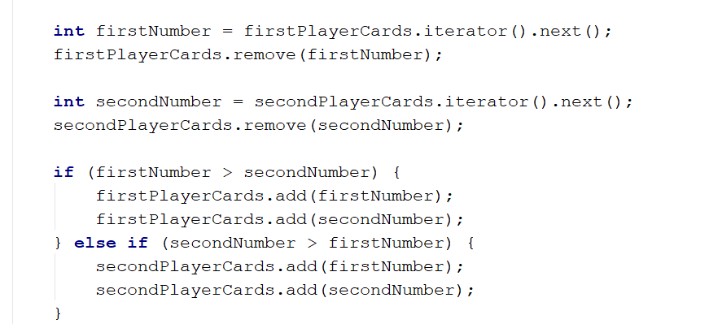
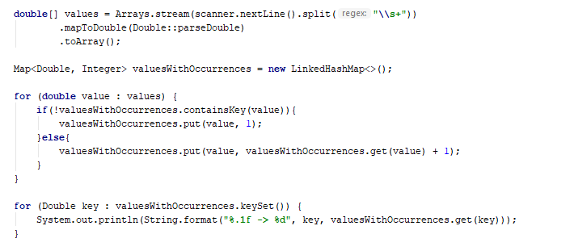
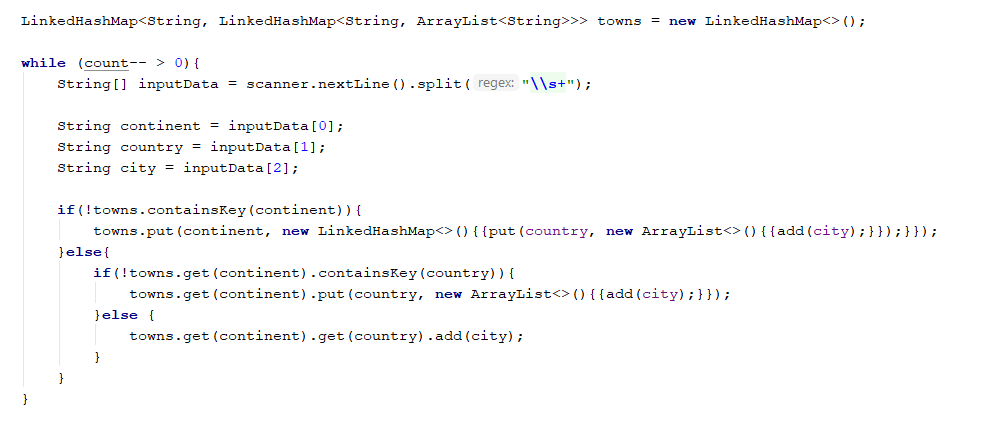
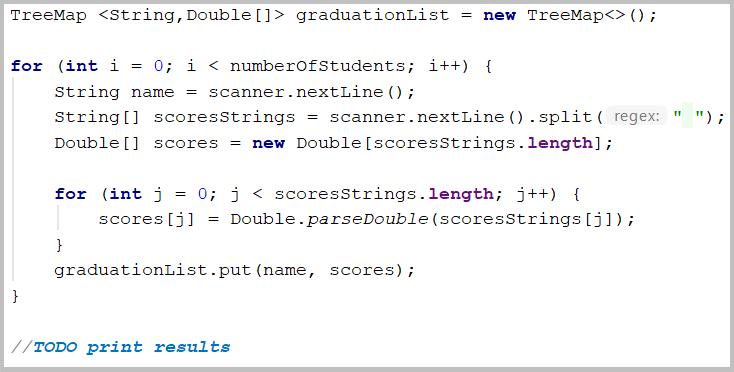

# **Lab: Java Advanced Sets and Maps**

Problems for exercises and homework for the “Java Advanced” course @ SoftUni.
You can check your solutions here: https://judge.softuni.bg/Contests/1462

## **I. Sets**

### **1. Parking Lot**

Write program that:
- Record car number for every car that enter in parking lot
- Remove car number when the car go out
- Input will be string in format [direction, carNumber]
- input end with string "END"

Print the output with all car numbers which are in parking lot 

### **Examples**

|Input|	Output|
|:-----|:-------|
|IN, CA2844AA IN, CA1234TA OUT, CA2844AA IN, CA9999TT IN, CA2866HI OUT, CA1234TA IN, CA2844AA OUT, CA2866HI IN, CA9876HH IN, CA2822UU END|CA2822UU CA2844AA CA9999TT CA9876HH|
|IN, CA2844AA IN, CA1234TA OUT, CA2844AA OUT, CA1234TA END|Parking Lot is Empty|

### **Hints**

- Car numbers are unique
- Use the methods isEmpty()

<b>Solution: <a href="./Ex01ParkingLot.java">Ex01ParkingLot.java</a></b>

### 2. SoftUni Party

There is a party in SoftUni. Many guests are invited and they are two type: VIP and regular. When guest come check if he/she exist in any of two reservation lists
All reservation numbers will be with 8 chars
All VIP numbers start with digit
There will be 2 command lines. First is "PARTY" - party is on and guests start coming. Second is "END" – then party is over and no more guest will come
Output have to all guest, who didn't come to the party (VIP must be first) 

### **Examples**

|Input|	Output|
|:-----|:-------|
|7IK9Yo0h 9NoBUajQ Ce8vwPmE SVQXQCbc tSzE5t0p PARTY 9NoBUajQ Ce8vwPmE SVQXQCbc END|2 7IK9Yo0h tSzE5t0p|
|m8rfQBvl fc1oZCE0 UgffRkOn 7ugX7bm0 9CQBGUeJ 2FQZT3uC dziNz78I mdSGyQCJ LjcVpmDL fPXNHpm1 HTTbwRmM B5yTkMQi 8N0FThqG xys2FYzn MDzcM9ZK PARTY 2FQZT3uC dziNz78I mdSGyQCJ LjcVpmDL fPXNHpm1 HTTbwRmM B5yTkMQi 8N0FThqG m8rfQBvl fc1oZCE0 UgffRkOn 7ugX7bm0 9CQBGUeJ END|2 MDzcM9ZK xys2FYzn|

<b>Solution: <a href="./Ex02SoftUniParty.java">Ex02SoftUniParty.java</a></b>

### 3. **"Voina" - Number game**

Write program that:
- Read 20 numbers for both players
- Numbers will be Integer, separated with " " (single space).
- Every player can hold only unique numbers 
- Each Round both players get top number from their own. Player with bigger number get both numbers and add it on the bottom of his own numbers
- Game end after 50 rounds or if any player lose all of his numbers
- Output must be "First Player Win!", "Second Player Win!" or "Draw!"

### ***Examples**

|Input|	Output|
|:-----|:-------|
|26 58 16 92 44 65 65 77 57 23 71 57 7 52 85 44 32 70 38 23 43 95 33 51 62 93 57 55 0 31 32 95 68 34 30 51 37 32 11 97|Second player win!|
|74 78 82 42 19 39 29 69 20 42 31 77 57 36 76 26 4 9 83 42 15 43 80 71 22 88 78 35 28 30 46 41 76 51 76 18 14 52 47 38|First player win!|

### **Hints**

- Use Iterator<E> and next() for finding top number in decks
- Think where to check if any player is without cards
- When you find top number, be sure to remove it immediately

<b>Solution: <a href="./Ex03Voina.java">Ex03Voina.java</a></b>

### **II. Maps**

### **4. Count Real Numbers**

Write a program that counts the occurrence of real numbers. The input is a single line with real numbers separated by spaces. Print the numbers in the order of appearance. All numbers must be formatted to one digit after the decimal point.

### **Examples**

|Input|	Output|
|:-----|:-------|
|-2.5 4 3 -2.5 -5.5 4 3 3 -2.5 3|-2.5 -> 3 4.0 -> 2 3.0 -> 4 -5.5 -> 1|
|2.3 4.5 4.5 5.5 5.5 2.3 3.0 3.0 4.5 4.5 3.0 3.0 4.0 3.0 5.5 3.0 2.3 5.5 4.5 3.0|2.3 -> 3 4.5 -> 5 5.5 -> 4 3.0 -> 7 4.0 -> 1|

<b>Solution: <a href="./Ex04CountRealNumbers.java">Ex04CountRealNumbers.java</a></b>

### **5. Average Students Grades**

Write a program, which reads the name of a student and their grades and adds them to the student record, then prints grades along with their average grade – ordered the output by the names of the students.

### **Input**

On the first line N – the number of students, then on the next N lines student name  with grade.

### **Examples**

|Input|	Output|
|:-----|:-------|
|7 Ivancho 5.20 Mariika 5.50 Ivancho 3.20 Mariika 2.50 Stamat 2.00 Mariika 3.46|Stamat 3.00	Ivancho -> 5.20 3.20 (avg: 4.20) Mariika -> 5.50 2.50 3.46 (avg: 3.82) Stamat -> 2.00 3.00 (avg: 2.50)|
|4 Vladimir 4.50 Petko 3.00 Vladimir 5.00|Petko 3.66	Petko -> 3.00 3.66 (avg: 3.33) Vladimir -> 4.50 5.00 (avg: 4.75)|
|5 Gosho 6.00 Gosho 5.50 Gosho 6.00 Ivan 4.40|Petko 3.30	Gosho -> 6.00 5.50 6.00 (avg: 5.83) Ivan -> 4.40 (avg: 4.40) Petko -> 3.30 (avg: 3.30)|

### **Hints**

- Use a TreeMap (String  ArrayList<Double>) 
- Check if the name exists before adding the grade. If it doesn’t, add it to the map.
- Pass through all key-value pairs in the map and print the results. 
- Think of way to get the average grades for each student.
- You can do that with an ordinary loop or with Stream API

<b>Solution: <a href="./Ex05AverageStudentsGrades.java">Ex05AverageStudentsGrades.java</a></b>

### **6. Product Shop**

Write a program that prints information about food shops in Sofia and the products they store. Until the "Revision" command you will receive an input in the format: "{shop}, {product}, {price}"
Take in mind that if you receive a shop you already have received you must collect its product information.
Your output must be ordered by shop name and must be in the format:
{shop}->
Product: {product}, Price: {price}
The price should be formated to one digit after the decimal point.

Examples

|Input|	Output|
|:-----|:-------|
|lidl, juice, 2.30 fantastico, apple, 1.20 kaufland, banana, 1.10 fantastico, grape, 2.20 Revision|fantastico-> Product: apple, Price: 1.2 Product: grape, Price: 2.2 kaufland-> Product: banana, Price: 1.1 lidl-> Product: juice, Price: 2.3|
|tmarket, peanuts, 2.20 GoGrill, meatballs, 3.30 GoGrill, HotDog, 1.40 tmarket, sweets, 2.20 Revision|GoGrill-> Product: meatballs, Price: 3.3 Product: HotDog, Price: 1.4 tmarket-> Product: peanuts, Price: 2.2 Product: sweets, Price: 2.2|

<b>Solution: <a href="./Ex06ProductShop.java">Ex06ProductShop.java</a></b>

### 7. Cities by Continent and Country**

Write a program to read continents, countries and their cities, put them in a nested map and print them in the order of first appearance.

### **Examples**

|Input|	Output|
|:-----|:-------|
|9 Europe Bulgaria Sofia Asia China Beijing Asia Japan Tokyo Europe Poland Warsaw Europe Germany Berlin Europe Poland Poznan Europe Bulgaria Plovdiv Africa Nigeria Abuja Asia China Shanghai|Europe:   Bulgaria -> Sofia, Plovdiv   Poland -> Warsaw, Poznan   Germany -> Berlin Asia:   China -> Beijing, Shanghai   Japan -> Tokyo Africa:   Nigeria -> Abuja|
|3 Europe Germany Berlin Europe Bulgaria Varna Africa Egypt Cairo|Europe:   Germany -> Berlin   Bulgaria -> Varna Africa:   Egypt -> Cairo|
|8 Africa Somalia Mogadishu Asia India Mumbai Asia India Delhi Europe France Paris Asia India Nagpur Europe Germany Hamburg Europe Poland Gdansk Europe Germany Danzig|Africa:   Somalia -> Mogadishu Asia:   India -> Mumbai, Delhi, Nagpur Europe:   France -> Paris   Germany -> Hamburg, Danzig   Poland -> Gdansk|

### **Hints**

- Use a nested Map (String  (Map ArrayList<String>)) 
- Check if the continent exists before adding the country. If it doesn’t, add it to the dictionary.
- Check if the country exists, before adding the city. If it doesn’t, add it to the dictionary.

- Pass through all key-value pairs in the Map and the values’ key-value pairs and print the results.

<b>Solution: <a href="./Ex07CitiesByContinentAndCountry.java">Ex07CitiesByContinentAndCountry.java</a></b>

### **8. Academy Graduation**

Write a program that:
- Read from console number of student for a track
- Read on pair of rows:
  - First line is name of student
  - Second line is his score for different number of courses
- Print on console “{name} is graduated with {average scores)”

### **Examples**

|Input|	Output|
|:-----|:-------|
|3 Gosho 3.75 5 Mara 4.25 6 Pesho 6 4.5|Gosho is graduated with 4.375 Mara is graduated with 5.125 Pesho is graduated with 5.25|
|5 Gruio 4.36 5.50 3.30 5.63 2.57 5.75 2.81 4.89  Trendafilka 3.10 5.35 3.30 3.35 5.64 4.99 2.75 4.68  Mite 3.45 3.23 3.03 5.42 5.46 4.15 2.26 5.95  Roza 2.08 3.48 3.36 2.73 2.96 4.54 3.70 3.85 Ganio 4.75 4.92 3.78 4.79 4.82 4.75 2.81 2.13|Ganio is graduated with 4.09375 Gruio is graduated with 4.351249999999999 Mite is graduated with 4.11875 Roza is graduated with 3.3375 Trendafilka is graduated with 4.145|

### **Hints**

- Think about proper type of map
- Value can be array
- Nested loop and one more variable will be need for average score

<b>Solution: <a href="./Ex08AcademyGraduation.java">Ex08AcademyGraduation.java</a></b>

<b>Document with tasks description: <a href="../../resources/L07SetsAndMaps/03. Java-Advanced-Sets-and-Maps-Lab.docx">03. Java-Advanced-Sets-and-Maps-Lab.docx</a></b>

