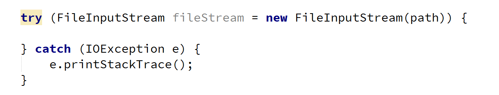

# **Lab: Files and Streams**

Problems for exercises and homework for the “Java Advanced” course @ SoftUni.
You can check your solutions here: https://judge.softuni.bg/Contests/1493.

For this lab exercises you are given a zipped folder with resources, that you will need to use. For each exercise submit the output of the program, not the code.

## I.	Stream Basics

### 1.	Read File

You are given a file named "input.txt". Read and print all of its contents as a sequence of bytes (the binary representation of the ASCII code for each character) separated by a single comma. 
Submit in Judge only the output of the program.

### Examples

<table>
<thead>
<tr>
<th>Input</th>
<th>Output</th>
</tr>
</thead>
<tbody>
<tr>
<td>On January 1 , 1533 , Michael Angelo,then fifty-seven years old, writes…</td>
<td>11101111 10111011 10111111 1001111 1101110 100000 1001010 1100001 1101110 1110101…</td>
</tr>
<tr>
<td>Two households, both alike in dignity, In fair Verona, where we lay our scene…</td>
<td>1010100 1110111 1101111 100000 1101000 1101111 1110101 1110011 1100101 1101000…</td>
</tr>
</tbody>
</table>
	
### Hints

- Create a string variable holding the path to the file. If, for example, the file is located in "D:\"

- Use try-with-resources to open the file and to be sure that it will be closed after you are done with it

- Use the read() method to read each byte of the file until it returns -1

- Select the output of the program and copy it [Ctrl + C]

- Paste the output in Judge

<b>Solution: <a href="./Ex01ReadFile.java">Ex01ReadFile.java</a></b>

### 2.	Write to File

Read the file named "input.txt" that is provided for this exercise and write all its content to a file while skipping any punctuation. Skip the following symbols: ',', '.', '!', '?'. 

Submit in Judge only the output of the program.

### Examples

<table>
<thead>
<tr>
<th>Input</th>
<th>Output</th>
</tr>
</thead>
<tbody>
<tr>
<td>On January 1 , 1533 , Michael Angelo, then fifty-seven years old, writes</td>
<td>On January 1  1533  Michael Angelo then fifty-seven years old writes</td>
</tr>
<tr>
<td>Two households, both alike in dignity. In fair Verona, where we lay our scene.	</td>
<td>Two households both alike in dignity In fair Verona where we lay our scene</td>
</tr>
</tbody>
</table>

### Hints

- Create a FileInputStream to read the file
- Create a FileOutputStream to write to a file
- Create a list, containing all characters that you need to skip and check if the current char is contained in it

<b>Solution: <a href="./Ex02WriteToFile.java">Ex02WriteToFile.java</a></b>

 
### 3.	Copy Bytes

Read the file named "input.txt" and write to another file every character's ASCII representation.
Write every space or new line as it is, e.g. as a space or a new line.
### Examples

<table>
<thead>
<tr>
<th>Input</th>
<th>Output</th>
</tr>
</thead>
<tbody>
<tr>
<td>On January 1 , 1533 , Michael Angelo, then fifty-seven years old, writes…</td>
<td>79110 749711011797114121 49 44 49535151 44 771059910497101108 6511010310110811144 116104101110 10210510211612145115101118101110 12110197114115 11110810044 119114105116101115</td>
</tr>
</tbody>
</table>

### Hints

- Get the value of every byte as string and then write its every digit one by one

<b>Solution: <a href="./Ex03CopyBytes.java">Ex03CopyBytes.java</a></b>

### 4.	Extract Integers

Read the file provided, named "input.txt" and extracts all integers that are not a part of a word in a separate file. A valid integer is surrounded with white spaces.

Submit in Judge only the output of the program.

### Examples

<table>
<thead>
<tr>
<th>Input</th>
<th>Output</th>
</tr>
</thead>
<tbody>
<tr>
<td>On January 1 , 1533 , Michael Angelo, then fifty-seven years old, writes…</td>
<td>1 1533 …</td>
</tr>
</tbody>
</table>

### Hints

- Wrap a FileInputStream in a Scanner and use the methods, hasNext(), hasNextInt() and nextInt()

<b>Solution: <a href="./Ex04ExtractIntegers.java">Ex04ExtractIntegers.java</a></b>

### 5.	Write Every Third Line

Read the file provided, named "input.txt" and write to another file all lines which number is divisible by 3. Line numbers start from one.

Submit in Judge only the output of the program.

### Examples

<table>
<thead>
<tr>
<th>Input</th>
<th>Output</th>
</tr>
</thead>
<tbody>
<tr>
<td>On January 1 , 1533 ,  Michael Angelo,  then fifty-seven years old,  writes from Florence to  Tommaso de' Cavalieri,  a youth of noble Roman family,</td>
<td>then fifty-seven years old, Tommaso de' Cavalieri,</td>
</tr>
</tbody>
</table>

### Hints

- To get the functionality to read and write lines use BufferedReader and PrintWriter
- Wrap streams appropriately

 

<b>Solution: <a href="./Ex05WriteEveryThirdLine.java">Ex05WriteEveryThirdLine.java</a></b>

### 6.	Sort Lines

Read the file provided, named "input.txt" and sort all lines. Write text to another text file. Use Path and Files Classes. 

Submit in Judge only the output of the program.

### Examples

<table>
<thead>
<tr>
<th>Input</th>
<th>Output</th>
</tr>
</thead>
<tbody>
<tr>
<td>C A B D</td>
<td>A B C D</td>
</tr>
</tbody>
</table>

### Hints

- To read all lines together use Files.readAllLines()

- To sort the list of strings use Collections.sort()

<b>Solution: <a href="./Ex06SortLines.java">Ex06SortLines.java</a></b>

### 7.	List Files

You are provided a folder named "Files-and-Streams". Create a program that lists the names and file sizes (in bytes) of all files that are placed directly in it (do not include files in nested folders).

Submit in Judge only the output of the program.

### Examples

<table>
<thead>
<tr>
<th>Input</th>
<th>Output</th>
</tr>
</thead>
<tbody>
<tr>
<td></td>
<td>input.txt: [size in bytes] output.txt: [size in bytes]</td>
</tr>
</tbody>
</table>

### Hints

- Use the File class and its method listFiles()

<b>Solution: <a href="./Ex07ListFiles.java">Ex07ListFiles.java</a></b>

### 8.	Nested Folders

You are provided a folder named "Files-and-Streams". Create a program that lists the names of all directories in it (including all nested directories).
On the last line, print the count of all folders, including the root folder.

Submit in Judge only the output of the program.

### Examples

<table>
<thead>
<tr>
<th>Input</th>
<th>Output</th>
</tr>
</thead>
<tbody>
<tr>
<td></td>
<td>... Streams-and-Files Files-and-Streams Streams-and-Files Serialization Streams-and-Files [folder count] folders</td>
</tr>
</tbody>
</table>

### Hints

- Use the File class and its method listFiles()

<b>Solution: <a href="./Ex08NestedFolders.java">Ex08NestedFolders.java</a></b>

### 9.	Serialize Custom Object

Create a class called "Cube". It should have properties for color, width, height and depth.

Create an instance of the class with the following values:

- Color: "green"
- Width: 15.3
- Height: 12.4
- Depth: 3.0

Serialize and deserilalize the instance created. When saved to a file the object should look like something like the example below.

### Examples

<table>
<thead>
<tr>
<th>Input</th>
<th>Output</th>
</tr>
</thead>
<tbody>
<tr>
<td>(no input)</td>
<td></td>
</tr>
</tbody>
</table>

### Hints

- Create a class called Cube, which should implement the Serializable interface:

 
- Create a new instance of the Cube class and set its properties:
 

- Use ObjectOutputStream to serialize the object:

<b>Solution: <a href="./Ex09SerializeCustomObject.java">Ex09SerializeCustomObject.java</a></b>

<b>Document with tasks description: <a href="../../resources/L09StreamsFilesDirectories/04. Java-Advanced-Fiels-and-Directories-Lab.docx">04. Java-Advanced-Fiels-and-Directories-Lab.docx</a></b>
