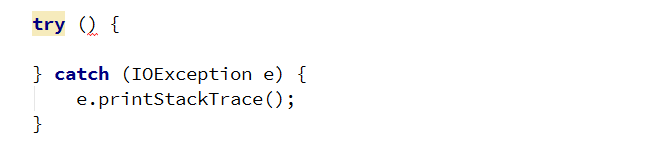
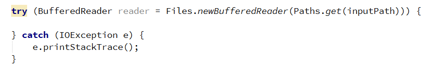
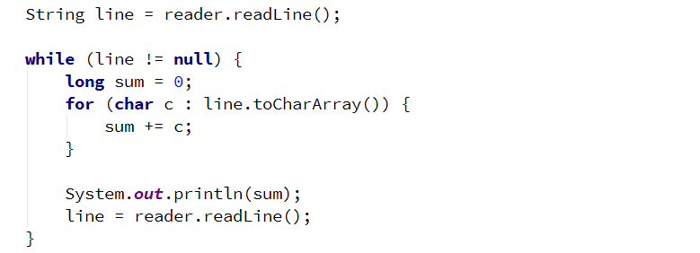
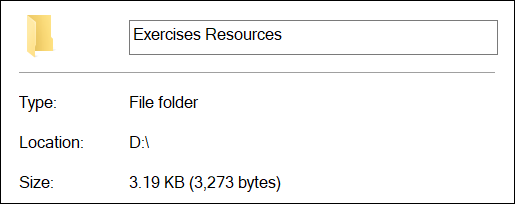

# Exercise: Files and Directories

This document defines the exercises for the "Java Advanced" course @ Software University. 
You can check your solutions here: https://judge.softuni.bg/Contests/1506.
For this exercises you are given a zipped folder with resources, that you will need to use. For each exercise submit the output of the program, not the code.

### 1. Sum Lines

Write a program that reads a text file (input.txt from the Resources - Exercises) and prints on the console the sum of the ASCII symbols of each of its lines. Use BufferedReader in combination with FileReader.

### Examples

<table>
<thead>
<tr>
<th>Input</th>
<th>Output</th>
</tr>
</thead>
<tbody>
<tr>
<td>On January 1 , 1533 ,  Michael Angelo,  then fifty-seven years old,  writes from Florence to  Tommaso de' Cavalieri,  a youth of noble Roman family,</td>
<td>1452 1397 2606 670 1573 2028 2762</td>
</tr>
</tbody>
</table>

### Hints

- Use try-with-resources to handle file

- Create a BufferedReader to read each line of the file

- Get the ASCII code of each character in the line and add it to the sum for the current line and print the sum on the console

### 2. Sum Bytes

Write a program that reads a text file (input.txt from the Resources - Exercises)  and prints on the console the sum of the ASCII symbols of all characters inside of the file. Use BufferedReader in combination with FileReader.

<table>
<thead>
<tr>
<th>Input</th>
<th>Output</th>
</tr>
</thead>
<tbody>
<tr>
<td>On January 1 , 1533 ,  Michael Angelo,  then fifty-seven years old,  writes from Florence to  Tommaso de' Cavalieri,  a youth of noble Roman family,</td>
<td>12488</td>
</tr>
</tbody>
</table>

### Hints

- You can modify your solution to the previous problem
- Use a type that will not overflow like long or BigInteger

### 3. ALL CAPITALS!

Write a program that reads a text file (input.txt from the Resources - Exercises)  and changes the casing of all letters to upper. Write the output to another file (output.txt). 

### Examples

<table>
<thead>
<tr>
<th>Input</th>
<th>Output</th>
</tr>
</thead>
<tbody>
<tr>
<td>On January 1 , 1533 ,  Michael Angelo,  then fifty-seven years old,  writes from Florence to  Tommaso de' Cavalieri,  a youth of noble Roman family,</td>
<td>ON JANUARY 1 , 1533 ,  MICHAEL ANGELO,  THEN FIFTY-SEVEN YEARS OLD,  WRITES FROM FLORENCE TO  TOMMASO DE' CAVALIERI,  A YOUTH OF NOBLE ROMAN FAMILY,</td>
</tr>
</tbody>
</table>

### Hints

- Use BufferedReader and PrintWriter.

### 4. Count Character Types

Write a program that reads a list of words from the file (input.txt from the Resources - Exercises)  and finds the count of vowels, consonants and punctuation marks. Assume that:

- a, e, i, o, u are vowels, only lower case
- All others are consonants
- Punctuation marks are (!,.?)
- Do not count whitespace.

Write the results to another file – output.txt.

### Examples

<table>
<thead>
<tr>
<th>Input</th>
<th>Output</th>
</tr>
</thead>
<tbody>
<tr>
<td>On January 1 , 1533 , Michael Angelo, then fifty-seven years old, writes from Florence to Tommaso de' Cavalieri, a youth of noble Roman family,</td>
<td>Vowels: 41 Consonants: 72 Punctuation: 6</td>
</tr>
</tbody>
</table>

### Hints

- Use BufferedReader and PrintWriter.

### 5. Line Numbers

Write a program that reads a text file (inputLineNumbers.txt from the Resources - Exercises) and inserts line numbers in front of each of its lines. The result should be written to another text file – output.txt. 

### Examples

<table>
<thead>
<tr>
<th>Input</th>
<th>Output</th>
</tr>
</thead>
<tbody>
<tr>
<td>Two households, both alike in dignity, In fair Verona, where we lay our scene, From ancient grudge break to new, Where civil blood makes civil hands. From forth the fatal loins of these two A pair of star-cross'd lovers take their life; Whose misadventured piteous overthrows Do with their death bury their parents' strife.</td>
<td>1. Two households, both alike in dignity, 2. In fair Verona, where we lay our scene, 3. From ancient grudge break to new, 4. Where civil blood makes civil hands. 5. From forth the fatal loins of these two  6. A pair of star-cross'd lovers take their life; 7. Whose misadventured piteous overthrows 8. Do with their death bury their parents' strife.</td>
</tr>
</tbody>
</table>

### 6. Word Count

Write a program that reads a list of words from the file words.txt (from the Resources - Exercises) and finds how many times each of the words is contained in another file text.txt (from the Resources – Exercises). Matching should be case-insensitive.

Write the results in file results.txt. Sort the words by frequency in descending order.

<table>
<thead>
<tr>
<th>Input</th>
<th>Output</th>
</tr>
</thead>
<tbody>
<tr>
<td>of which The</td>
<td>of - 6 which - 2 The - 1</td>
</tr>
</tbody>
</table>

### 7. Merge Two Files
Write a program that reads the contents of two text files (inputOne.txt, inputTwo.txt from Resources Exercises) and merges them together into a third one.

<table>
<thead>
<tr>
<th>File 1</th>
<th>File 2</th>
<th>Output</th>
</tr>
</thead>
<tbody>
<tr>
<td>1 2 3</td>
<td>4 5 6</td>
<td>1 2 3 4 5 6</td>
</tr>
</tbody>
</table>

### 8. Get Folder Size

Write a program that traverses a folder and calculates its size in bytes. Use Folder Exercises Resources in Resources.

<table>
<thead>
<tr>
<th>Input</th>
<th>Output</th>
</tr>
</thead>
<tbody>
<tr>
<td></td>
<td>Folder size: 2878</td>
</tr>
</tbody>
</table>

### 9. Copy a Picture

Write a program that makes a copy of a .jpg file using FileInputStream, FileOutputStream, and byte[] buffer. Set the name of the new file as picture-copy.jpg.

### 10. Serialize Array List

Write a program that saves and loads an ArrayList of doubles to a file using ObjectInputStream and ObjectOutputStream. Set the name of the file as list.ser.

### 11. \*Serialize Custom Object

Write a program that saves and loads the information about a custom object using ObjectInputStream and ObjectOutputStream. 
Create a simple class called "Course" that has a String field containing its name and an integer field containing the number of students attending the course. Set the name of the save file as course.ser.

### 12. \*Create Zip Archive

Write a program that reads three .txt files and creates a zip archive named files.zip. Use FileOutputStream, ZipOutputStream, and FileInputStream.

<b>Document with tasks description: <a href="../../resources/L10StreamsFilesDirectoriesExercises/04. Java-Advanced-Files-and-Directories-Exercises.docx">04. Java-Advanced-Files-and-Directories-Exercises.docx</a></b>
