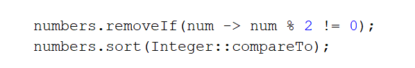
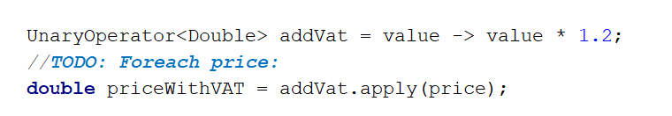

# Lab: Functional Programming

This document defines the exercises for "Java Advanced" course @ Software University. Please submit your solutions (source code) of all below described problems in Judge.

### 1. Sort Even Numbers

Write a program that reads one line of Integers separated by ", ".

- Print the even numbers
- Sort them in ascending order 
- Print them again.

Use 2 Lambda Expressions to do so.

###Examples

<table>
<thead>
<tr>
<th>Input</th>
<th>Output</th>
</tr>
</thead>
<tbody>
<tr>
<td>4, 2, 1, 3, 5, 7, 1, 4, 2, 12</td>
<td>4, 2, 4, 2, 12 2, 2, 4, 4, 12</td>
</tr>
<tr>
<td>1, 3, 5</td>
<td>(no output)</td>
</tr>
<tr>
<td>2, 4, 6</td>
<td>2, 4, 6 2, 4, 6</td>
</tr>
</tbody>
</table>

Input	Output

### Hints

- It is up to you what type of data structures you will use to solve this problem
- Try different ways, for solving this problem, for example:

<b>Solution: <a href="./Ex01SortEvenNumbers.java">Ex01SortEvenNumbers.java</a></b>

### 2. Sum Numbers

Write a program that reads one line of Integers separated by ", ". Print the count of the numbers and their sum.

Use a Function\<String, Integer>

### Examples

<table>
<thead>
<tr>
<th>Input</th>
<th>Output</th>
</tr>
</thead>
<tbody>
<tr>
<td>4, 2, 1, 3, 5, 7, 1, 4, 2, 12</td>
<td>Count = 10 Sum = 41</td>
</tr>
<tr>
<td>2, 4, 6</td>
<td>Count = 3 Sum = 12</td>
</tr>
</tbody>
</table>

### Hints

- Use Function\<String, Integer> for parsing integers after you split them to a String array

<b>Solution: <a href="./Ex02SumNumbers.java">Ex02SumNumbers.java</a></b>

### 3. Count Uppercase Words

Write a program that reads one line of text from the console. Print the count of words that start with a Uppercase letter, after that print all these words in the same order, like you found them in the text.

Use a Predicate\<String>

### Examples

<table>
<thead>
<tr>
<th>Input</th>
<th>Output</th>
</tr>
</thead>
<tbody>
<tr>
<td>The following example shows how to use Predicate</td>
<td>2 The Predicate</td>
</tr>
<tr>
<td>Write a program that reads one line of text from console. Print count of words that start with Uppercase, after that print all those words in the same order like you find them in text.</td>
<td>3 Write Print Uppercase,</td>
</tr>
</tbody>
</table>

### Hints

- Use a Predicate<String> like an if-condition

<b>Solution: <a href="./Ex03CountUppercaseWords.java">Ex03CountUppercaseWords.java</a></b>

<b>Solution: <a href="./Ex03CountUppercaseWords01.java">Ex03CountUppercaseWords01.java</a></b>

### 4. Add VAT

Write a program that reads one line of Double prices separated by ", ". Print the prices with added VATs for all of them.  Format them to the 2nd digit after the decimal point. The order of the prices must remain the same.

Use an UnaryOperator\<Double>

### Examples

<table>
<thead>
<tr>
<th>Input</th>
<th>Output</th>
</tr>
</thead>
<tbody>
<tr>
<td>1.38, 2.56, 4.4</td>
<td>Prices with VAT: 1.66 3.07 5.28</td>
</tr>
<tr>
<td>1, 3, 5, 7</td>
<td>Prices with VAT: 1.66 3.07 5.28</td>
</tr>
</tbody>
</table>

### Hints

<b>Solution: <a href="./Ex04AddVAT.java">Ex04AddVAT.java</a></b>

 
### 5. Filter by Age

Write a program that reads an integer N on the first line. And on next N lines read pairs of "[name], [age]". Then read three more lines with:

- Condition - "younger" or "older"
- Age - Integer
- Format - "name", "age" or "name age"

Depending on the condition, print the pairs in the right format.

Don’t use any build-in functionality. Write your own methods.

### Examples

<table>
<thead>
<tr>
<th>Input</th>
<th>Output</th>
<th>Input</th>
<th>Output</th>
<th>Input</th>
<th>Output</th>
</tr>
</thead>
<tbody>
<tr>
<td>5 Pesho, 20 Gosho, 18 Mimi, 29 Ico, 31 Simo, 16 older 20 name age</td>
<td>Pesho - 20 Mimi - 29 Ico - 31</td>
<td>5 Pesho, 20 Gosho, 18 Mimi, 29 Ico, 31 Simo, 16 younger 20 name</td>
<td>Gosho Simo</td>
<td>5 Pesho, 20 Gosho, 18 Mimi, 29 Ico, 31 Simo, 16 younger 50 age</td>
<td>20 18 29 31 16</td>
</tr>
</tbody>
</table>

<b>Solution: <a href="./Ex05FilterByAge.java">Ex05FilterByAge.java</a></b>

#### 6. Find Evens or Odds

You are given a lower and an upper bound for a range of integer numbers. Then a command specifies if you need to list all even or odd numbers in the given range. Use predicates that need to be passed to a method.

###Examples

<table>
<thead>
<tr>
<th>Input</th>
<th>Output</th>
</tr>
</thead>
<tbody>
<tr>
<td>1 10 odd</td>
<td>1 3 5 7 9</td>
</tr>
<tr>
<td>20 30 even</td>
<td>20 22 24 26 28 30</td>
</tr>
</tbody>
</table>

<b>Solution: <a href="./Ex06FindEvensOrOdds.java">Ex06FindEvensOrOdds.java</a></b>

<b>Document with tasks description: <a href="../../resources/L11FunctionalProgramming/05. Java-Advanced-Functional-Programming-Lab.docx">05. Java-Advanced-Functional-Programming-Lab.docx</a></b>

