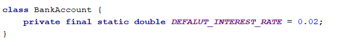

# Lab: Defining Classes

Problems for exercises and homework for the "Java Advanced" course @ SoftUni.

You can check your solutions here: https://judge.softuni.bg/Contests/Practice/Index/1517.

## Part I: Defining Classes

### 1. Car Info

Create a class named Car.

The class should have public fields for:

- Make: String
- Model: String
- Horse Power: int

Create a new class and ensure proper naming

 
Define the fields

 
Create a Test client in the same package
 

You should be now able to use your class

 
### Private Fields

Change the access modifiers of all class fields to private.

When done go back to the main method you should have compilation errors, like this:

### Getters and Setters

Create getters and setters for each class field. 

Getter for the car make:
 

Setter for the car make:

Do the same for all the fields.

### Fix main method

You should set and get the values by using the correct methods

 
### Create Car Info Method

This method should return the info about any car object in the following format:

"The car is: {made} {model} – {horsePower} HP."

You have to figure out how to create a method and to use it in the outside code as shown below

### Test The Program 

Read a cars objects, add them to collection of your chose and the print each one on the console using the carInfo() method. The input consists of single integer N the number of lines representing car objects. One each line you will read car info in the following format {make} {model} - {horsePower} separated by single space.

### Examples

<table>
<thead>
<tr>
<th>Input</th>
<th>Output</th>
</tr>
</thead>
<tbody>
<tr>
<td>3 Chevrolet Impala 390 Luskava Jigula 500 Golqma Kola 49</td>
<td>The car is: Chevrolet Impala - 390 HP. The car is: Luskava Jigula - 500 HP. The car is: Golqma Kola - 49 HP.</td>
</tr>
<tr>
<td>5 This Car 1 Was Made 2 Only For 3 Test Purposes 4 No Way 5</td>
<td>The car is: This Car - 1 HP. The car is: Was Made - 2 HP. The car is: Only For - 3 HP. The car is: Test Purposes - 4 HP. The car is: No Way - 5 HP.</td>
</tr>
</tbody>
</table>

<b>Solution: <a href="./car">Car Constructors</a></b>

 
## Part II: Constructors

### 2. Car Constructors

Make proper constructors for the Car class so you can create car objects with different type of input information.
If you miss information about field of type String set the value to "unknown", and for integer field set -1.

First declare constructor which takes only the car make as parameter:

Also create constructor which sets all the fields:

Read information about car the same way as the previous task, however this time use constructors to create the objects, not creating object with the default constructor. You should be able to handle different types of input, the format will be the same as the previous task, but this time some of the data may be missing. For an example you can get only the car make – which means you have to set the car model to "unknown" and the Horse Power value to -1. There will be lines with complete car data, declare constructor which sets all the fields. 
You have to add the car objects to a collection of your chose and print the data as in the previous task. The input will always have one or three elements on each line.

### Examples

<table>
<thead>
<tr>
<th>Input</th>
<th>Output</th>
</tr>
</thead>
<tbody>
<tr>
<td>2 Chevrolet Golqma Kola 49</td>
<td>The car is: Chevrolet unknown - -1 HP. The car is: Golqma Kola - 49 HP.</td>
</tr>
<tr>
<td>4 Was Only For 3 Test Purposes 4 No Way 5</td>
<td>The car is: Was unknown - -1 HP. The car is: Only For - 3 HP. The car is: Test Purposes - 4 HP. The car is: No Way - 5 HP.</td>
</tr>
</tbody>
</table>

<b>Solution: <a href="./car">Car Constructors</a></b>

### 3. Bank Account

Create class BankAccount.

The class should have private fields for:

- Id: int (Starts from 1 and increments for every new account)
- Balance: double
- Interest rate: double (Shared for all accounts. Default value: 0.02)

The class should also have public methods for:

- setInterestRate(double interest): void (static)
- getInterest(int Years): double
- deposit(double amount): void

Create a test client supporting the following commands:

- Create
- Deposit {Id} {Amount}
- SetInterest {Interest}
- GetInterest {ID} {Years}
- End

### Examples

<table>
<thead>
<tr>
<th>Input</th>
<th>Output</th>
<th>Comments</th>
</tr>
</thead>
<tbody>
<tr>
<td>Create Deposit 1 20 GetInterest 1 10 End</td>
<td>Account ID1 created Deposited 20 to ID1 4.00</td>
<td></td>
</tr>
<tr>
<td>Create Create Deposit 1 20 Deposit 3 20 Deposit 2 10 SetInterest 1 GetInterest 1 1 GetInterest 2 1 GetInterest 3 1 End</td>
<td>Account ID1 created Account ID2 created Deposited 20 to ID1 Account does not exist Deposited 10 to ID2 20.00 10.00 Account does not exist</td>
<td>Sets the global interest rate to 1. Prints interest for bank account with id 1 for 1 year period.</td>
</tr>
</tbody>
</table>

### Solution

Create the class as usual and create a constant for the default interest rate

 

Create the static and non-static fields, all private

 
Set the id of an account upon creation while incrementing the global account count

 
Create a setter for the global interest rate. Making the method static will let you access it through the class name

 
Implement deposit() and getInterest()

<b>Solution: <a href="./bank">Bank Account</a></b>

<b>Document with tasks description: <a href="../../resources/L13DefiningClasses/06. Java-OOP-Basics-Defining-Classes-Lab.docx">06. Java-OOP-Basics-Defining-Classes-Lab.docx</a></b>
