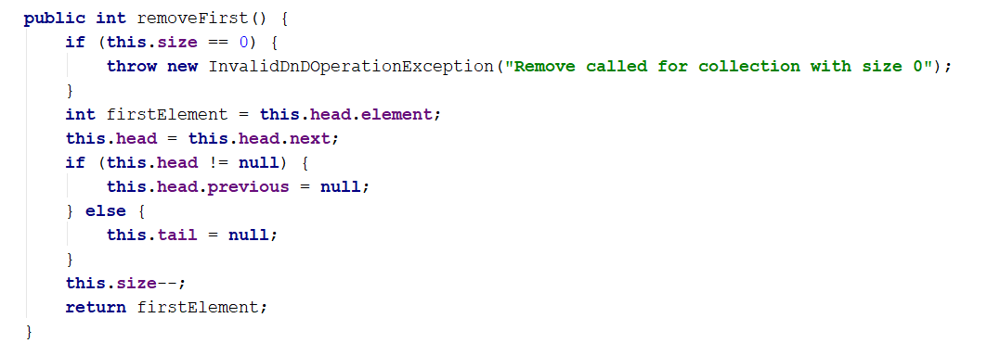

# Workshop Create Linked List

Overview

In this workshop we are going to implement our own Linked List data structure.
A linked list should consists of nodes, also we'll implement methods to make the structure easy to use.

This figure shows how the structure should look. Specifically we are going to implement a doubly linked list. We have nodes, each node has two reference properties pointing to other nodes and a value property which contains some kind of data. By definition, the doubly linked list has a head (list start) and a tail (list end).

The typical operations over a doubly linked list are add / remove element at both ends and traverse.

You can find more detailed information here: https://en.wikipedia.org/wiki/Doubly_linked_list 

### 1. Implement ListNode

The first step when implementing a linked / doubly linked list is to understand that we need two classes:

- Node class to hold a single list node (its value + next node + previous node)
- LinkedList to hold the entire list (its head + tail + operations)

Now, let's write the list node class. It should hold a Value and a reference to its previous and next node. It can be inner class, because we will need it only internally from the doubly linked list class:

The class ListNode is called recursive data structure, because it references itself recursively. In this case our nodes' value property will be type of int, later in the course we will refactor the structure to be more generic.

### 2. Add Head, Tail and Size Fields

Now, let's define the head, tail and size of the linked list:

### 3. Implement addFirst(int) Method

Next, implement the addFirst(element) method:

Adding an element at the start of the list (before its head) has two scenarios (considered in the above code):

- Empty list -> add the new element as head and tail in the same time.
- Non-empty list -> add the new element as new head and redirect the old head as second element, just after the new head.

The above graphic visualizes the process of inserting a new node at the start (head) of the list. The red arrows denote the removed references from the old head. The green arrows denote the new references to the new head.

### 4. Implement addLast(int) Method

Next, implement the addLast(int element) method for appending a new element as the list tail. It should be very similar to the addFirst(int element) method. The logic inside it exactly the same, but we append the new element at the tail instead of at the head.

### 5. Implement removeFirst() Method

Next, let's implement the method removeFirst() -> int. It should remove the first element from the list and move its head to point to the second element. The removed element should be returned as a result from the method. In case of empty list, the method should throw an exception. We have to consider the following three cases:

- Empty list -> throw and exception.
- Single element in the list -> make the list empty (head == tail == null).
- Multiple elements in the list -> remove the first element and redirect the head to point to the second element (head = head.next).

A sample implementation of removeFirst() method is given below:

### 6. Implement removeLast() Method

Next, let's implement the method removeLast()  int. It should remove the last element from the list and move its tail to point to the element before the last. It is very similar to the method removeFirst().

### 7. Implement forEach(Consumer\<Integer>) Method

We have a doubly linked list. We can add elements to it. But we cannot see what's inside, because the list still does not have a method to traverse its elements (pass through each of them, one by one). Now let's define the forEach(Consumer\<Integer> consumer) method. The algorithm behind this method is simple: start from head and pass to the next element until the last element is reached (its next element is null). A sample implementation is given below:

For an example if you want to print all of the elements you can use the following code:

Where linkedList is LinkedList type object.

### 8. Implement toArray() Method

Now, implement the next method: toArray()  int[]. It should copy all elements of the linked list to an array of the same size. You could use the following steps to implement this method:

- Allocate an array int[] of size this.size.
- Pass through all elements of the list and fill them to arr[0], arr[1], …, arr[this.size-1].
- Return the array as result.

Congratulations! You have implemented your doubly linked list.

### 9. \*\* Implement addAfter(int, int) Method

For this task you have to figure out how to add a new element on a specific place inside your data structure. In order for this task to be done easily consider the position at which you have to add the new element the first position after you find the first parameter of the method. Do not consider edge cases in this situation only check id the list is empty or the element you have to find is not presented in the list then you have to throw a proper kind of exception.

### 10. \*\*\* Implement removeAfter(int, int) Method

This time you are all alone but you have all it takes to do it. Right you can figure out what you have to do pretty easy, based on the previous method. Good Luck, however you don't need one.

<b>Document with tasks description: <a href="../../resources/L15LinkedList/07. Workshop-LinkedList.docx">07. Workshop-LinkedList.docx</a></b>

"Somewhere, something incredible is waiting to be known." – Carl Sagan