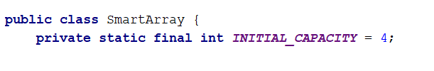
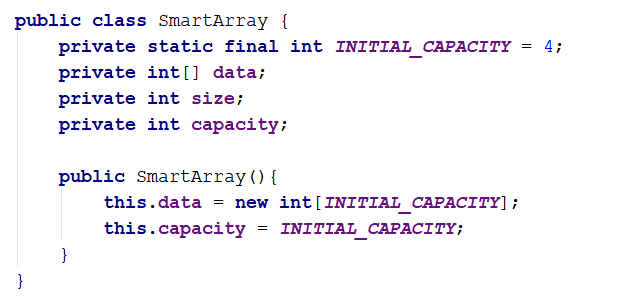
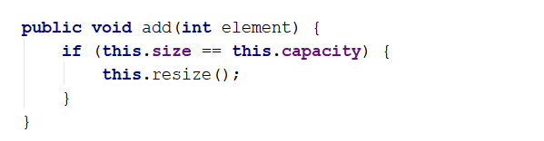
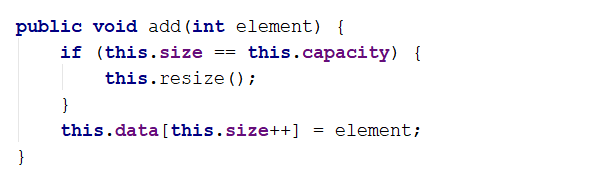
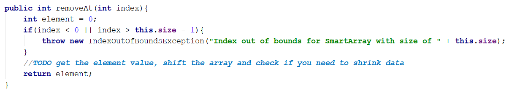
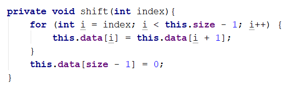
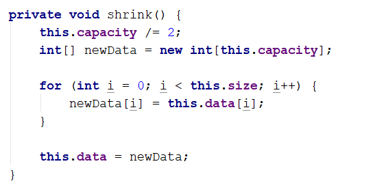
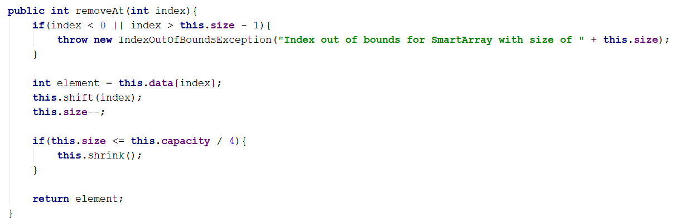
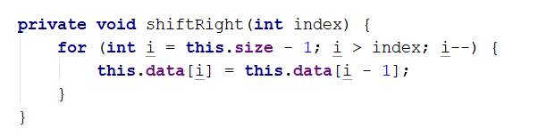
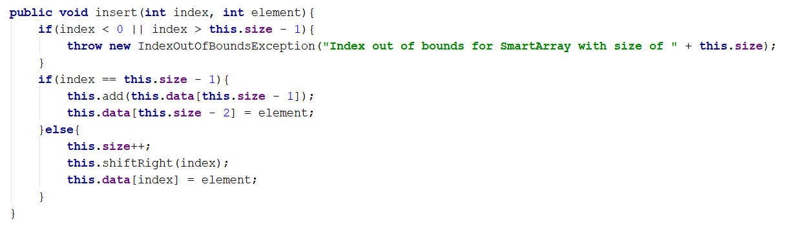

# Workshop Create SmartArray

### Overview

In this workshop we will create our own SmartArray which will be something like ArrayList. Our SmartArray will work only with integers for now, but this will be fixed later in the course.

The SmartArray will have the following functionality:

- void add (int element) - Adds the given element to the end of the list
- int removeAt (int index) - Removes the element at the given index
- void insert(int index, int element) – Adds element at the specific index, the element at this index gets shift to the right alongside with any following elements, increasing size.
- boolean contains (int element) - Checks if the list contains the given element returns (true or false)

Feel free to implement your own functionality or to write the methods by yourself.

### 1. Implement the SmartArray class

#### Details about the structure

First of all, we must make it clear how our structure should work under the provided public functionality.

- It should hold a sequence of items in an array. 
- The structure should have capacity that grows twice when it is filled, always starting at 4. 

The SmartArray class should have the properties listed below:

- Int[] items - An array which will hold all of our elements
- Int size – Holds the size of the array

The structure will have internal methods to make managing of the internal collection easier.

- resize – this method will be used to increase the internal collection's length twice
- shrink – this method will help us to decrease the internal collection's length twice 
- shiftLeft – this method will help us to rearrange the internal collection's elements after removing one.
- shiftRight – this method we will use when we inset element at specific index

#### Implementation

Create class SmartArray and add private static constant field name INITIAL_CAPACITY and set the value to 4.
This field is used to declare the initial capacity of the internal array. It's always good practice to use constants instead of magic numbers in your classes, this approach makes the code better for managing and reading.

Keep in mind that if the internal array has length of 4 this doesn’t mean that our collection holds 4 elements. So we need a field which will keep the information of the actual size of the elements in the structure.
This field should be updated every single time when we make changes related to the count of the elements like adding or removing.
The whole class with the fields and the constructor should look like that:

### 2. Implement void add(int element) Method

It is time to create the method responsible for adding new elements to the end of our collection. It looks like an easy task, but keep in mind that if our internal array is filled, we have to increase it twice the length it currently has and add the new element.
Each time we add an element we have to check if it is necessary to resize the collection:

If we have to make more space for more elements then we can simply declare private method resize() – which will double the capacity of the inner array:

After we have ensured that there will be enough room for adding new element to the SmartArray, we can simply add the element at the next index:

### 3. Implement int removeAt(int index) Method

This method has the functionality to remove item at given index and return the item. Let's think about how to solve this problem dividing it to smaller tasks.

- First we must check if the index is valid, if it's not throw proper exception.

- Get the item on the given index and assign it to a variable which will be returned at the end.
- Now we have to shift the elements on the next indexes.

- Decrease the size and check if it is 4 times smaller than the capacity, it is probably, but not necessary a good idea to shrink the array, so we can free some memory. Our SmartArray will keep only integers, which makes it pretty easy on memory consumption, however if we had to store complex objects which would have taken a lot more memory we would have wanted to think about shrinking anyway.
- The shrink() should be something like this:

Now we are ready to continue with the removeAt method implementation.
The whole method should look like this:

### 4. Implement void insert(int index, int item) Method

You are already familiar with this method so let us head straight to the implementation.

- We have index parameter, so we must validate the index
- We must check if array resize is required
- We have to rearrange the items to free the space on the required index.
- Finally insert the given item on the index and increase the size.

You probably already noticed that since we have a method to rearrange the items to left, used to fill up the empty space when we remove item, we must have method to rearrange items to right, so let's create it.
Starting from the end of the actual elements this method will copy every single item on the next index, the cycle will end on the requested index as parameter.

Now complete the insert method:

### 5. Implement boolean contains(int element) Method

This method should check if the given element is in the collection. Return true if it is and false if it's not. It's a simple task, so you should do it all on your own.  

### 6. Implement forEach(Consumer\<Integer>) Method

Implement a method which will allow you to iterate through each element of the SmartArray. You can pass Consumer\<> to the method.

Feel free to add methods whatever you may find useful or interesting.

<b>Document with tasks description: <a href="../../resources/L16SmartArray/07. Workshop-SmartArray.docx">07. Workshop-SmartArray.docx</a></b>

"Imagination will often carry us to worlds that never were, but without it we go nowhere." Carl Sagan