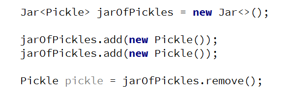
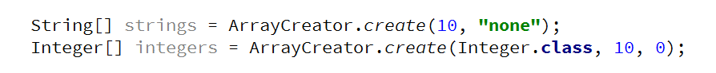
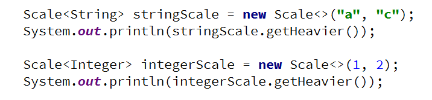
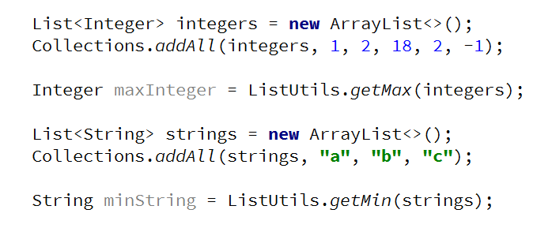

# Lab: Generics

Problems for exercises and homework for the "Java OOP Advanced" course @ SoftUni.

## Part I: Generics

### 1. Jar of T

Create a class Jar\<> that can store anything. 

It should have two public methods:

- void add(element)
- element remove()

Adding should add on top of its contents. Remove should get the topmost element.

### Examples

 
### Hints

Use the syntax Jar\<T> to create a generic class

<b>Solution: <a href="./Ex01JarOfT">Jar Of T</a></b>

### 2. Generic Array Creator

Create a class ArrayCreator with a method and a single overload to it:

- static T[] create(int length, T item)
- static T[] create(Class\<T>, int length, T item)

The method should return an array with the given length and every element should be set to the given default item.

### Examples

<b>Solution: <a href="./Ex02GenericArrayCreator">Generic Array Creator</a></b>

 
### 3. Generic Scale

Create a class Scale\<T> that holds two elements - left and right. The scale should receive the elements through its single constructor:

- Scale(T left, T right)

The scale should have a single method: 

- T getHeavier()

The greater of the two elements is heavier. The method should return null if elements are equal.

### Examples

<b>Solution: <a href="./Ex03GenericScale">Generic Scale</a></b>

 
### 4. List Utilities

Create a class ListUtils that you will use through several other exercises:

The class should have two static methods:

- T getMin(List\<T> list)
- T getMax(List\<T> list)

The methods should throw IllegalArgumentException if an empty list is passed.

### Examples

<b>Solution: <a href="./Ex04ListUtilities">List Utilities</a></b>

<b>Document with tasks description: <a href="../../resources/L17Generics/08.Java-Advanced-Generics-Lab.docx">08.Java-Advanced-Generics-Lab.docx</a></b>
