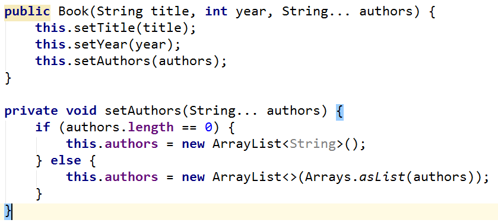
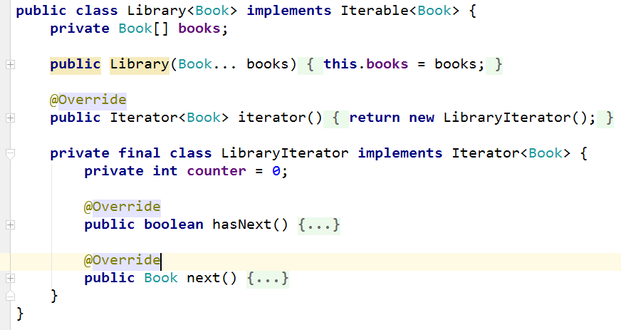

# Lab: Iterators and Comparators

Problems for exercises and homework for the "Java Advanced" course @ SoftUni.

### 1. Book

Create a class Book from UML diagram below:

<table>
<thead>
<tr>
<th aling="center">Book</th>
</tr>
</thead>
<tbody>
<tr>
<td>-	title: String -	year: int -	authors: List&lt;String&gt;</td>
</tr>
<tr>
<td>-	setTitle(String) -	setYear(String) -	setAuthors(String…) +	getTitle(): String +	getYear(): int +	getAuthors(): List&lt;String&gt;</td>
</tr>
</tbody>
</table>

You can use only one constructor. Authors can be anonymous, one or many.

### Examples

##### Main.java

    public static void main(String[] args) {
        Book bookOne = new Book("Animal Farm", 2003, "George Orwell");
        Book bookThree = new Book("The Documents in the Case", 2002);
        Book bookTwo = new Book("The Documents in the Case", 1930, "Dorothy Sayers", "Robert Eustace");
        
        List<Book> books = new ArrayList<>();
        books.add(bookOne);
        books.add(bookTwo);
        books.add(bookThree); 
    }

### Solution

 
2.	Library
Create a class Library from UML diagram below:

<table>
<thead>
<tr>
<th aling="center">&lt;&lt;Iterable&lt;Book&gt;&gt;&gt; Library</th>
</tr>
</thead>
<tbody>
<tr>
<td>-	books: Book[]</td>
</tr>
<tr>
<td>+	iterator(): Iterator&lt;Book&gt;</td>
</tr>
</tbody>
</table>

Create a nested class LibIterator from UML diagram below:

<table>
<thead>
<tr>
<th aling="center">&lt;&lt;Iterator&lt;Book&gt;&gt;&gt; LibIterator</th>
</tr>
</thead>
<tbody>
<tr>
<td>-	counter: int</td>
</tr>
<tr>
<td>+	hasNext(): boolean</td>
</tr>
<tr>
<td>+	next(): Book</td>
</tr>
</tbody>
</table>

### Examples

##### Main.java

    public static void main(String[] args) {
        Book bookOne = new Book("Animal Farm", 2003, "George Orwell");
        Book bookThree = new Book("The Documents in the Case", 2002);
        Book bookTwo = new Book("The Documents in the Case", 1930, "Dorothy Sayers", "Robert Eustace");
    
        Library library = new Library<>(bookOne, bookTwo, bookThree);
    
        for (Book book : library) {
            System.out.println(book.getTitle());
        }
    }

### Solution

### 3. Comparable Book

Expand Book by implementing Comparable\<Book>

Book have to be compared by name. When name is equal, compare them by year.

Expand Book from UML diagram below:

<table>
<thead>
<tr>
<th aling="center">&lt;&lt;Comparable&lt;Book&gt;&gt;&gt; Book</th>
</tr>
</thead>
<tbody>
<tr>
<td>-	title: String -	year: int -	authors: List&lt;String&gt;</td>
</tr>
<tr>
<td>-	setTitle(String) -	setYear(String) -	setAuthors(String…) +	getTitle(): String +	getYear(): int +	getAuthors(): List&lt;String&gt; +	compareTo(Book): int</td>
</tr>
</tbody>
</table>

You can use only one constructor. Authors can be anonymous, one or many. 

### Examples

##### Main.java

    public static void main(String[] args) {
        Book bookOne = new Book("Animal Farm", 2003, "George Orwell");
        Book bookThree = new Book("The Documents in the Case", 2002);
        Book bookTwo = new Book("The Documents in the Case", 1930, "Dorothy Sayers", "Robert Eustace");
    
        if (bookOne.compareTo(bookTwo) > 0) {
            System.out.println(String.format("%s is before %s", bookOne, bookTwo));
        } else if (bookOne.compareTo(bookTwo) < 0) {
            System.out.println(String.format("%s is before %s", bookTwo, bookOne));
        } else {
            System.out.println("Book are equal");
        }
    
    }

### 4. Book Comparator

Create a class BookComparator from UML diagram below:

<table>
<thead>
<tr>
<th aling="center">&lt;&lt;Comparator&lt;Book&gt;&gt;&gt; BookComparator</th>
</tr>
</thead>
<tbody>
<tr>
<td>+	compare(Book, Book): int</td>
</tr>
</tbody>
</table>

BookComparator have to compare two books by:

1. Book title
2. Year of publishing a book

### Examples

##### Main.java

    public static void main(String[] args) {
        Book bookOne = new Book("Animal Farm", 2003, "George Orwell");
        Book bookThree = new Book("The Documents in the Case", 2002);
        Book bookTwo = new Book("The Documents in the Case", 1930, "Dorothy Sayers", "Robert Eustace");
    
        List<Book> books = new ArrayList<>();
        books.add(bookOne);
        books.add(bookTwo);
        books.add(bookThree);
    
        books.sort(new BookComparator());
    
        for (Book book : books) {
            System.out.println(book.getTitle() + book.getYear());
        }
    }

### NOTE: Packages must be removed before submission!

<b>Document with tasks description: <a href="../../resources/L17Generics/09. Java-Advanced-Iterators-and-Comparators-Lab.docx">09. Java-Advanced-Iterators-and-Comparators-Lab.docx</a></b>
