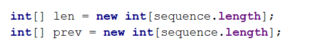

# Exercises: Basic Algorithms

Problems for exercises and homework for the "Java Advanced" course @ SoftUni.

### 1. Reverse Array

Write a program that reverses and prints an array. Use recursion.

### Examples

<table>
<thead>
<tr>
<th>Input</th>
<th>Output</th>
</tr>
</thead>
<tbody>
<tr>
<td>1 2 3 4 5 6</td>
<td>6 5 4 3 2 1</td>
</tr>
</tbody>
</table>

<b>Solution: <a href="./Ex01ReverseArray.java">Reverse Array</a></b>

### 2. Nested Loops To Recursion

Write a program that simulates the execution of n nested loops from 1 to n which prints the values of all its iteration variables at any given time on a single line. Use recursion.

### Examples

<table>
<thead>
<tr>
<th>Input</th>
<th>Output</th>
</tr>
</thead>
<tbody>
<tr>
<td>1</td>
<td>1 1 1 2 2 1 2 2</td>
</tr>
<tr>
<td>3</td>
<td>1 1 1 1 1 2 1 1 3 1 2 1 1 2 2 … 3 2 3 3 3 1 3 3 2 3 3 3</td>
</tr>
</tbody>
</table>

<b>Solution: <a href="./Ex02NestedLoopsToRecursion.java">Nested Loops To Recursion</a></b>

### 3. Connected Areas in a Matrix

Let’s define a connected area in a matrix as an area of cells in which there is a path between every two cells. 
Write a program to find all connected areas in a matrix. 
On the console, print the total number of areas found, and on a separate line some info about each of the areas – its position (top-left corner) and size. 
Order the areas by size (in descending order) so that the largest area is printed first. If several areas have the same size, order them by their position, first by the row, then by the column of the top-left corner. So, if there are two connected areas with the same size, the one which is above and/or to the left of the other will be printed first.

On the first line, you will get the number of rows.

On the second line, you will get the number of columns.

The rest of the input will be the actual matrix.

### Examples

<table>
<thead>
<tr>
<th>Input</th>
<th>Output</th>
</tr>
</thead>
<tbody>
<tr>
<td>4 9 -	-	-	*	-	-	-	*	- -	-	-	*	-	-	-	*	- -	-	-	*	-	-	-	*	- -	-	-	-	*	-	*	-	-</td>
<td>Total areas found: 3 Area #1 at (0, 0), size: 13 Area #2 at (0, 4), size: 10 Area #3 at (0, 8), size: 5</td>
</tr>
<tr>
<td>5 10 *	-	-	*	-	-	-	*	-	- *	-	-	*	-	-	-	*	-	- *	-	-	*	*	*	*	*	-	- *	-	-	*	-	-	-	*	-	- *	-	-	*	-	-	-	*	-	-</td>
<td>Total areas found: 4 Area #1 at (0, 1), size: 10 Area #2 at (0, 8), size: 10 Area #3 at (0, 4), size: 6 Area #4 at (3, 4), size: 6</td>
</tr>
</tbody>
</table>

### Hints

- Create a method to find the first traversable cell which hasn’t been visited. This would be the top-left corner of a connected area. If there is no such cell, this means all areas have been found.
- You can create a class to hold info about a connected area (its position and size). Additionally, you can implement IComparable and store all areas found in a SortedSet.

<b>Solution: <a href="./Ex03ConnectedAreasInMatrix.java">Connected Areas in a Matrix</a></b>

### 4. The Matrix

You are given a matrix (2D array) of lowercase alphanumeric characters (a-z, 0-9), a starting position – defined by a start row startRow and a start column startCol – and a filling symbol fillChar. Let’s call the symbol originally at startRow and startCol the startChar. Write a program, which, starting from the symbol at startRow and startCol, changes to fillChar every symbol in the matrix which:

- is equal to startChar AND
- can be reached from startChar by going up (row – 1), down (row + 1), left (col – 1) and right (col + 1) and “stepping” ONLY on symbols equal startChar 

So, you basically start from startRow and startCol and can move either by changing the row OR column (not both at once, i.e. you can’t go diagonally) by 1, and can only go to positions which have the startChar written on them. Once you find all those positions, you change them to fillChar. 
In other words, you need to implement something like the Fill tool in MS Paint, but for a 2D char array instead of a bitmap.

### Input

On the first line, two integers will be entered – the number R of rows and number C of columns.

On each of the next R lines, C characters separated by single spaces will be entered – the symbols of the Rth row of the matrix, starting from the 0th column and ending at the C-1 column.

On the next line, a single character – the fillChar – will be entered.

On the last line, two integers – startRow and startCol – separated by a single space, will be entered.

### Output
The output should consist of R lines, each consisting of exactly C characters, NOT SEPARATED by spaces, representing the matrix after the fill operation has been finished.

### Constraints

0 < R, C < 20 

0 <= startRow < R 

0 <= startCol < C

All symbols in the input matrix will be lowercase alphanumerics (a-z, 0-9). The fillChar will also be alphanumeric and lowercase.
The total running time of your program should be no more than 0.1s
The total memory allowed for use by your program is 5MB

### Examples

<table>
<thead>
<tr>
<th>Example Input</th>
<th>Expected Output</th>
</tr>
</thead>
<tbody>
<tr>
<td>5 3 a a a a a a a b a a b a a b a x 0 0</td>
<td>xxx xxx xbx xbx xbx</td>
</tr>
<tr>
<td>5 3 a a a a a a a b a a b a a b a x 2 1</td>
<td>aaa aaa axa axa axa</td>
</tr>
</tr>
<tr>
<td>5 6 o o 1 1 o o o 1 o o 1 o 1 o o o o 1 o 1 o o 1 o o o 1 1 o o 3 2 1</td>
<td>oo11oo o1331o 133331 o1331o oo11oo</td>
</tr>
<tr>
<td>5 6 o o o o o o o o o 1 o o o o 1 o 1 1 o 1 1 w 1 o 1 o o o o o z 4 1</td>
<td>oooooo ooo1oo oo1o11 o11w1z 1zzzzz</td>
</tr>
<tr>
<td>5 6 o 1 o o 1 o o 1 o o 1 o o 1 1 1 1 o o 1 o w 1 o o o o o o o z 4 0</td>
<td>z1oo1z z1oo1z z1111z z1zw1z zzzzzz</td>
</tr>
</tbody>
</table>

<b>Solution: <a href="./Ex04TheMatrix.java">The Matrix</a></b>

### 5. Longest Increasing Subsequence

Let’s have a sequence of numbers S = {a1, a2, … an}. An increasing subsequence is a sequence of numbers within S where each number is larger than the previous. We do not change the relative positions of the numbers, e.g. we do not move smaller elements to the left to obtain longer sequences. If several sequences with equal length exist, find the left-most of them

### Examples

<table>
<thead>
<tr>
<th>Input</th>
<th>Output</th>
</tr>
</thead>
<tbody>
<tr>
<td>1 2 5 3 4</td>
<td>1 2 3 4</td>
</tr>
<tr>
<td>4 3 2 1</td>
<td>4</td>
</tr>
<tr>
<td>4 2 -1 3 5 5</td>
<td>2 3 5</td>
</tr>
</tbody>
</table>
	
### Solution

#### Dynamic Programming Approach

The LIS problem can be solved by dividing it into sub-problems – for each element at index i of the sequence S, find the LIS in the range [S0 … Si].

Example for S = { 3, 14, 5, 12, 15, 7, 8, 9, 11, 10, 1 }:

- LIS { 3 } => { 3 }
- LIS { 3, 14 } => { 3, 14 }
- LIS { 3, 14, 5 } => { 3, 5 }
- LIS { 3, 14, 5, 12 } => { 3, 5, 12 }
- etc.

For each index, we’ll keep track of the length of the LIS up to that index and the previous index of the LIS. E.g., the length of the LIS at index 5 is 3, the longest sequence ending in seq[5] is {3, 5, 7} and the index of the previous element of the subsequence (the number 5) is 2. The table below illustrates these computations:

<table>
<tbody>
<tr>
<th>index</th>
<td>0</td>
<td>1</td>
<td>3</td>
<td>2</td>
<td>4</td>
<td>5</td>
<td>6</td>
<td>7</td>
<td>8</td>
<td>9</td>
<td>10</td>
</tr>
<tr>
<th>S[]</th>
<td>3</td>
<td>14</td>
<td>5</td>
<td>12</td>
<td>15</td>
<td>7</td>
<td>8</td>
<td>9</td>
<td>11</td>
<td>10</td>
<td>1</td>
</tr>
<tr>
<th>len[]</th>
<td>1</td>
<td>2</td>
<td>2</td>
<td>3</td>
<td>4</td>
<td>3</td>
<td>4</td>
<td>5</td>
<td>6</td>
<td>6</td>
<td>1</td>
</tr>
<tr>
<th>prev[]</th>
<td>-1</td>
<td>0</td>
<td>0</td>
<td>2</td>
<td>3</td>
<td>2</td>
<td>5</td>
<td>6</td>
<td>7</td>
<td>7</td>
<td>-1</td>
</tr>
<tr>
<th>LIS</th>
<td>{3}</td>
<td>{3,14}</td>
<td>{3,5}</td>
<td>{3,5,12}</td>
<td>{3,5,12,15}</td>
<td>{3,5,7}</td>
<td>{3,5,7,8}</td>
<td>{3,5,7,8,9}</td>
<td>{3,5,7,8,9,11}</td>
<td>{3,5,7,8,9,10}</td>
<td>{1}</td>
</tr>
</tbody>
</table>

We need to calculate the info in the above table for every element of the original sequence S, so we’ll need two additional arrays with length equal to the length of S. Translating this into code within our method, we get:

 
#### Calculate LIS at Each Index

To obtain the longest increasing sequence up to a given index, we just have to find the LIS up to that point to which the current element can be appended as the largest. That is why, when considering the sequence {3, 14, 5} we obtained {3, 5}; we want to know the longest sequence in which the current number (5) participates.

We’ll do the following: 

- loop through each number in the sequence; 
- find the longest sequence up to that point which ends with a number which is smaller than the current.

Remember that we keep track of the length of each LIS in the len[] array. Restore the sequence.

<b>Solution: <a href="./Ex05LongestIncreasingSubSequence.java">Longest Increasing Subsequence</a></b>

<b>Document with tasks description: <a href="../../resources/L22AlgorithmsExercises/10.Workshop-Basic-Algorithms-Exercise.docx">10.Workshop-Basic-Algorithms-Exercise.docx</a></b>
