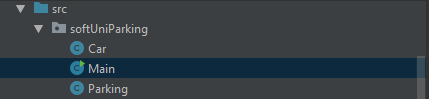

# Java Advanced Sample Exam

## Problem 1 – Hospital

Your task will be to prepare an electronic register for a hospital. In the hospital we have different departments:

- Cardiology
- Oncology
- Emergency department 
- etc. 

Each department has 20 rooms for patients and each room has 3 beds. When a new patient goes in the hospital, he/she is placed on the first free bed in the department. If there are no free beds, the patient should go in another hospital. Of course, in every hospital there are doctors. Each doctor can have patients in a different department. You will receive information about patients in the format {Department} {Doctor} {Patient}

After the "Output" command you will receive some other commands with what kind of output you need to print. The commands are: 

- {Department} – You need to print all patients in this department in the order of receiving
- {Department} {Room} – You need to print all patients in this room in alphabetical order
- {Doctor} – you need to print all patients for this doctor in alphabetical order

The program ends when you receive command "End".

### Input

On the first lines you will receive info for the hospital, department, doctors and patients in the following format:

{Department} {Doctor} {Patient}

When you read the "Output" line you will get one or more commands telling you what you need to print

Read commands for printing, ‘till you reach the command "End"

### Output

- {Department} – print all patients in this department in order of receiving on new line
- {Department} {Room} – print all patients in this room in alphabetical order each on new line
- {Doctor} – print all patients that are healed from doctor in alphabetical order on new line

### Constraints

- {Department} – single word with length 1 < n < 100
- {Doctor} – name and surname, both with length 1 < n < 20
- {Patient} – unique name with length 1 < n < 20
- {Room} – integer 1 <= n <= 20
- Time limit: 0.3 sec. Memory limit: 16 MB.

<table>
<thead>
<tr>
<th>Input</th>
<th>Output</th>
</tr>
</thead>
<tbody>
<tr>
<td>Cardiology Petar Petrov Ventsi Oncology Ivaylo Kenov Valio Emergency Mariq Mircheva Simo Cardiology Genka Shikerova Simon Emergency Ivaylo Kenov NuPogodi Cardiology Gosho Goshov Esmeralda Oncology Gosho Goshov Cleopatra Output Cardiology End</td>
<td>Ventsi Simon Esmeralda</td>
</tr>
</tbody>
</table>

<table>
<thead>
<tr>
<th>Input</th>
<th>Output</th>
</tr>
</thead>
<tbody>
<tr>
<td>Cardiology Petar Petrov Ventsi Oncology Ivaylo Kenov Valio Emergency Mariq Mircheva Simo Cardiology Genka Shikerova Simon Emergency Ivaylo Kenov NuPogodi Cardiology Gosho Goshov Esmeralda Oncology Gosho Goshov Cleopatra Output Cardiology 1 End</td>
<td>Esmeralda Simon Ventsi</td>
</tr>
</tbody>
</table>

<table>
<thead>
<tr>
<th>Input</th>
<th>Output</th>
</tr>
</thead>
<tbody>
<tr>
<td>Cardiology Petar Petrov Ventsi Oncology Ivaylo Kenov Valio Emergency Mariq Mircheva Simo Cardiology Genka Shikerova Simon Emergency Ivaylo Kenov NuPogodi Cardiology Gosho Goshov Esmeralda Oncology Gosho Goshov Cleopatra Output Ivaylo Kenov  End</td>
<td>NuPogodi Valio</td>
</tr>
</tbody>
</table>

<b>Solution: <a href="./Ex01Hospital.java">Hospital</a></b>

<b>Document with tasks description: <a href="../../resources/L24ExamPrep/01. Hospital_Условие.docx">01. Hospital_Условие.docx</a></b>

## Problem 2 – Sneaking
After our hero Sam got the recipe from the first problem, there is another thing he needs to check off from his to-do list. In order to make the recipe even more valuable, he needs to “eliminate” anyone who possesses the knowledge of it. That person is Sam’s sworn enemy - Nikoladze. Sam needs to get through a rectangular room of patrolling enemies until he finally reaches Nikoladze.

A standard room looks like this:

<table>
<thead>
<tr>
<th>Room</th>
<th>Legend</th>
</tr>
</thead>
<tbody>
<tr>
<td>......N... b......... ..d....... ......d... .....S....</td>
<td>S  Sam, the player character b/d  left/right-facing patrolling enemy N  Nikoladze .  Empty space</td>
</tr>
</tbody>
</table>

Each turn proceeds as follows:

- First, Enemies move either left or right, depending on which direction they are facing (b goes right, d goes left)
    - If an enemy is standing on the edge of the room, he flips his direction (from d to b or from b to d) and doesn’t move for the rest of the turn.
- If an enemy is on the same row as Sam, and also facing Sam (eg. .b.S.), the enemy kills Sam.
- After that, Sam moves in the direction he is instructed to (either U/D/L/R or W).
    - U -> Up, D -> Down, L -> Left, R -> Right, W -> Wait (Sam doesn’t move)
- If Sam moves onto an enemy (same row and column), Sam kills the enemy and leaves no trace of him.
- If Sam is reaches the same row as Nikoladze, Sam kills Nikoladze (replacing him with an X)

#### Problem 1. Input

- On the first line of input, you will receive n – the number of rows the room will consist of. Range: [2-20]
- On the next n lines, you will receive the room, which Sam will have to navigate.
- On the final line of input, you will receive a sequence of directions – one of (U, D, L, R, W)

#### Problem 2. Output

- If Sam is killed, print “Sam died at {row}, {col}”
- If Nikoladze is killed, print “Nikoladze killed!”
- Then, in both cases, print the final state of the room on the console, with either Sam or Nikoladze’s symbols replaced by an X.

#### Problem 3. Constraints

- The room will always be rectangular.
- There will always be enough moves for Sam to reach Nikoladze
- There will be no case where Sam is instructed to move out of the bounds of the room.
- There will be no case with two enemies on the same row.
- There will be no case with an enemy and Nikoladze standing on the same row.
- There will be no case where Sam reaches the same row and column as Nikoladze. 

#### Problem 4. Examples

<table>
<thead>
<tr>
<th>Input</th>
<th>Output</th>
<th>Comments</th>
</tr>
</thead>
<tbody>
<tr>
<td>5 ......N... b......... ..d....... ......d... .....S.... UUUUR</td>
<td>Sam died at 2, 5 ......N... ...b...... b....X.... .......... ..........</td>
<td>Turn 1: Enemies move, then Sam steps on the enemy on the 4th row. Turn 2: Enemies move, then Sam moves. Turn 3: Enemy 2 turns around, sees Sam and kills him.</td>
</tr>
<tr>
<td>3 N...... .b..... ..dS... WUUU</td>
<td>Nikoladze killed! X..S... ....... b......</td>
<td>Turn 1: Enemies move, Sam waits. Turn 2: Enemies move, Sam goes up, steps on an enemy. Turn 3: Enemies move, Sam goes up, kills Nikoladze.</td>
</tr>
<tr>
<td>6 ............. ....S........ .b........... ...........d. ............. ....N........ WWWDWWWDDRD</td>
<td>Nikoladze killed! ............. ............. ............b d............ ............. ....XS.......</td>
<td>Turn 1/2/3: Enemies move, Sam waits. Turn 4: Enemies move, Sam goes down. Turn 5/6/7: Enemies move, Sam waits. Turn 8/9: Enemies move, Sam goes down. Turn 10: Enemies move, Sam goes right. Turn 11: Enemies move, Sam goes down and kills Nikoladze.</td>
</tr>
</tbody>
</table>

<b>Solution: <a href="./Ex02Sneaking.java">Sneaking</a></b>

<b>Document with tasks description: <a href="../../resources/L24ExamPrep/02. Sneaking_Условие.docx">02. Sneaking_Условие.docx</a></b>

## Problem 3. SoftUni Parking

### I. Project Structure
For this problem you should create a new package named "softUniParking", which should hold inside the two classes both Car and Parking.  The Main class can also be inside this package however it is not a must it may also be outside the package. Your project structure should look like that:

##Pay attention to name the package, all the classes, their fields and methods exactly the same way they are presented in the following document. It is also important to keep the project structure as described above.**

### II. Car

    public class Car {
        // TODO: implement this class
    }

Create Java class Car that has the following structure: 

1 Fields

- make: String
- model: String
- horsePower: int
- registrationNumber: String
    
The class constructor should receive all the fields parameters (make, model, horsePower and registrationNumber).

2 Methods:

- Method toString() which returns the information about a single Car object in the following format:

      " Make: {make}"
      " Model: {model}"
      " HorsePower: {horse power}"
      "RegistrationNumber: {registration number}

### III. Parking

Write a Java class Parking that has data field, which stores objects of type Car with a corresponding unique registration number.

    public class Parking {
        // TODO: implement this class
    }

1 Fields

- cars – Map<String, Car>
- capacity - accessed only by the base class (responsible for the parking capacity).

The class constructor receive capacity(int) and should initialize the cars with a new Map instance, and set the value for the capacity.

2 Methods

- Method addCar(Car car) – first checks if there is already a car with tha provided car registration number and if there is the method returns the following message:

    "Car with that registration number, already exists!"
    Next checks if the count of the cars in the parking is more or equals than the capacity and if it is returns the following message:
    "Parking is full!"
    Finally if nothing from the previous conditions is true it just adds the current car to the cars in the parking and returns the message:
    "Successfully added new car {Make} {RegistrationNumber}"

- Method removeCar(string registrationNumber) – removes a car with the givven registration number. If the provided registration number does not exist returns the message: 

    "Car with that registration number, doesn't exists!"
    Otherwise, removes the car and returns the message:
    "Successfully removed {registrationNumber}"

- Method getCar(string registrationNumber) – returns the Car with the provided registration number
- Method removeSetOfRegistrationNumber(List<string> registrationNumbers) – removes all cars having the provided registration numbers and procceeds the same way as the RemoveCar() method
- Method getCount() – returns the number of stored Car objects.

Examples

This is an example how the Parking class is intended to be used. Make sure to comment out the parts that throw an error!

    public static void main(String[] args) {
    
            //Initialize the Parking
            Parking parking = new Parking(5);
    
            //Initialize Car
            Car car = new Car("Skoda", "Fabia", 65, "CC1856BG");
    
            //Initialize second Car object
            Car car2 = new Car("Audi", "A3", 110, "EB8787MN");
    
            System.out.println(car.toString());
            //Make: Skoda
            //Model: Fabia
            //HorsePower: 65
            //RegistrationNumber: CC1856BG
    
            System.out.println(parking.addCar(car));
            //Successfully added new car Skoda CC1856BG
    
            System.out.println(parking.addCar(car));
            //Car with that registration number, already exists!
    
            System.out.println(parking.addCar(car2));
            //Successfully added new car Audi EB8787MN
    
            System.out.println(parking.getCar("EB8787MN").toString());
            //Make: Audi
            //Model: A3
            //HorsePower: 110
            //RegistrationNumber: EB8787MN
    
            System.out.println(parking.removeCar("EB8787MN"));
            //Successfullyremoved EB8787MN
    
            System.out.println(parking.getCount()); //1
    
            //Initialize listOfRegistrationNumbers
            List<String> regNums = new ArrayList<>();
    
            //add two registrationNumbers
            regNums.add("EB8787MN");
            regNums.add("invalid");
    
            // call method removeSetOfRegistrationNumber with our list
            parking.removeSetOfRegistrationNumber(regNums);
    
            System.out.println(parking.getCount()); //1 
    }

Submission

- Submit single .zip file, containing repository package, with the two classes inside (Car and Parking) and the Main class, there is no specific content required inside the Main class e. g. you can do any kind of local testing of you program there. However there should be main(String[] args) method inside:

<b>Solution: <a href="./softUniParking">SoftUni Parking</a></b>

<b>Document with tasks description: <a href="../../resources/L24ExamPrep/03. SoftUni Parking_Условие.docx">03. SoftUni Parking_Условие.docx</a></b>
