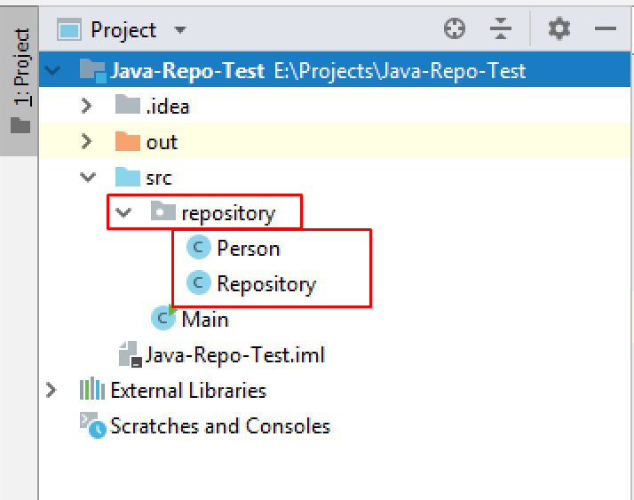

# Demo Exam Java Advanced Exam - 17 Feb 2019

## Problem 1. Socks

George is a young poorly organized person and he always have problems with his socks. He has always dreamed of a program that makes sets of his washed socks. You are the chosen one to help him with his problem. Good luck!
First you will be given a sequence of integers representing the left socks. Afterwards you will be given another sequence of integers representing the right socks. 
Check all of the left socks and right socks in order to make sets. Take the last given left sock, and the first given right sock and check if the left sock is bigger than the right sock and if it is – you have to create a pair. A pair is created when you add the value of the right sock to the value of the left one. If you have a pair, remove both the left and the right socks from their collections. 

If the right sock value is bigger –and check remove the left one the next one. 

If their values are equal – remove the right sock and increment the value of the left one with 1

George wants to wear the biggest set, so you have to find out which one it is.

Afterwards print the created pairs from the first added to the last, separated by a space. 

### Input

- On the first line of input you will receive the integers, representing the left socks, separated by a single space. 
- On the second line of input you will receive the integers, representing the right socks, separated by a single space.

### Output

- On the first line of output - print the biggest pair in the format specified above. 
- On the second line - print the pairs, separated by a single space in the order specified above.

### Constraints

- All of the given numbers will be valid integers in the range \[1, 10000].
- There will always be at least 1 pair.
- Allowed time/memory: 100ms/16MB.

### Examples

<table>
<thead>
<tr>
<th>Input</th>
<th>Output</th>
<th>Comment</th>
</tr>
</thead>
<tbody>
<tr>
<td>10 8 7 13 8 4 4 7 3 6 4 12</td>
<td>16 15 16 13 12</td>
<td>First, we take the last given left sock – 4 and the first given right sock – 4. They are equal, so we have to remove the right sock and increment the left with 1. The left sock becomes 5 and the collection looks like this Left: 10 8 7 13 8 5 Right: 7 3 6 4 12 Next, we take the left with value 5 and the right with value 7 – the right is bigger, so we remove the left and the collections should look like this: Left: 10 8 7 13 8 Right: 7 3 6 4 12 After that we the left 8 and the right 7 – the left is bigger, so we have our first pair with value 15. In the end we have to print the biggest pair, which in this case is with value 16, and the collection of pairs, that we have created.</td>
</tr>
<tr>
<td>9 5 4 7 8 5 2 6 9 1 4 5 7 9 6 3 5 4 7</td>
<td>16 10 10 15 16</td>
<td></td>
</tr>
</tbody>
</table>

<b>Solution: <a href="./Ex01Socks">Socks</a></b>

<b>Document with tasks description: <a href="../../resources/Z_DemoExam/01. Socks_Условие.docx">01. Socks_Условие.docx</a></b>

## Problem 2. Excel Functions

You will receive a table as an input - matrix with several rows and cols. The first row is the header row. Each header can have some filter applied. As a second parameter you will receive a command. You should execute the command and print the table filtered, sorted or modified.

Commands:

- hide {header} 

If you receive hide command, delete the column with the corresponding header.

- sort {header}

If you receive sort command, sort the rows in the table by the header given in ascending order. Note that the header row should not be sorted.

- filter {header} {value}

If you receive filter command, return the rows with the value given in the corresponding header.

### Input / Constraints

You will receive as first parameter multidimensional array of strings, and a string as second parameter – a command.  The input will always be valid.

### Output

Print on the console each of the table`s rows; rows elements should be separated by " | ";

### Examples

<table>
<thead>
<tr>
<th>Input</th>
<th>Output</th>
</tr>
</thead>
<tbody>
<tr>
<td>4 name, age, grade Peter, 25, 5.00 George, 34, 6.00 Marry, 28, 5.49 sort name</td>
<td>name | age | grade George | 34 | 6.00 Marry | 28 | 5.49 Peter | 25 | 5.00</td>
</tr>
<tr>
<td>4 firstName, age, grade, course Peter, 25, 5.00, C#-Advanced George, 34, 6.00, Tech Marry, 28, 5.49, Ruby filter firstName Marry</td>
<td>firstName | age | grade | course Marry | 28 | 5.49 | Ruby</td>
</tr>
</tbody>
</table>

... Use filters to temporarily hide some of the data in a table, so you can focus on the data you want ...

<b>Solution: <a href="./Ex02ExcelFunctions">Excel Functions</a></b>

<b>Solution: <a href="./Ex02ExcelFunctions01">Excel Functions - other solution</a></b>

<b>Document with tasks description: <a href="../../resources/Z_DemoExam/02. Excel Functions_Условие.docx">02. Excel Functions_Условие.docx</a></b>

## Problem 3. Repository

### I. Project Structure

For this problem you should create a new package named "repository", which should hold inside the two classes both Person and Repository.  The Main class can also be inside this package however it is not a must it may also be outside the package. Your project structure should look like that:

### **Pay attention to name the package, all the classes, their fields and methods exactly the same way they are presented in the following document. It is also important to keep the project structure as described above.**

### II.	Person

    public class Person {
        // TODO: implement this class
    }

Create Java class Person that has the following structure: 

1 Fields:

- name – String
- age –  int
- birthDate – String

The class constructor should receive all the fields parameters (name, age, birthDate).

2 Methods:

- Method toString() which returns the information about a single Person object in the following format:

        "Name: {name}"
        "Age: {age}"
        "Birthday: {birthDate}"

### III. Repository
Write a Java class Repository that has data field, which stores objects of type Person with a corresponding unique ID, that is assigned when they are added starting from zero.

    public class Repository {
        // TODO: implement this class
    }

1 Fields

- data – Map<Integer, Person>

The class constructor should initialize the data with a new Map instance. 

2 Methods

- Method add(Person person) – adds an Person to the data field with the next ID value 
- Method get(int id) – returns the Person object stored with the given ID
- Method update(int id, Person newPerson) – replaces the Person stored to the coresponding ID with the new Person object. Returns false if the ID doesn't exist, otherwise return true.
- Method delete(int id) – deletes the Person object by the given id. Return false if the id doesn't exist, otherwise return true.
- Method getCount() – returns the number of stored Person objects.

### Examples

This is an example how the Repository class is intended to be used. Make sure to comment out the parts that throw an error!

Sample code usage

    public static void main(String[] args) {
    
         //Initialize the repository
         Repository repository = new Repository();
    
         //Initialize Person
         Person person = new Person("Pesho", 14, "13-07-2004");
    
         //Add two entities
         repository.add(person);
    
         //Initialize second Person object
         Person secondPerson = new Person("Gosho", 42, "21-09-1976");
         repository.add(secondPerson);
    
         System.out.println(repository.get(0).toString());
         //Name: Pesho
         //Age: 14
         //Birthday: 13-07-2004
    
         System.out.println(repository.get(1).toString());
         //Name: Gosho
         //Age: 42
         //Birthday: 21-09-1976
    
    
         //Update person with id 1
         repository.update(1, new Person("Success", 20, "01-01-1999"));
    
         System.out.println(repository.get(1).toString());
         //Name: Success
         //Age: 20
         //Birthday: 01-01-1999
    
         //Delete entity
         repository.delete(0);
    
         System.out.println(repository.getCount());
         //1
    }

### Constraints

•	The ID should change only when we add a new Person.
•	The ID is unique per repository – if two repositories are instantiated, each has its own counter.

###Submission

•	Submit single .zip file, containing repository package, with the two classes inside (Person and Repository) and the Main class, there is no specific content required inside the Main class e. g. you can do any kind of local testing of you program there. However there should be main(String[] args) method inside:

<b>Solution: <a href="./Ex03Repository">Repository</a></b>

<b>Document with tasks description: <a href="../../resources/Z_DemoExam/03. Repository_Условие.docx">03. Repository_Условие.docx</a></b>
