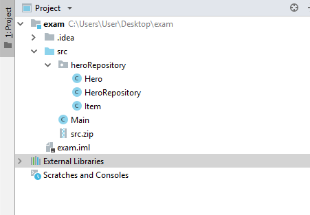

# Java Advanced Exam - 24 February 2019

## Problem 01. Club Party

A new club has opened in town and everyone wants to go partying. The club has many halls and people may only go there with reservations.
You will be given n – an integer specifying the halls' maximum capacity. Then you will be given input line which will contain English alphabet letters and numbers, separated by a single space. The input for the line should be read from the last inserted to the first one. The letters represent the halls and the numbers – the people in a single reservation. Companies of people should go in the halls. The first entered hall is the first which people are entering. Every reservation takes specific capacity, equal to its number.
When a hall overflows (it cannot contain a given number of people due to lack of enough free capacity), it passes the people to the next entered hall. If there is no open hall and you receive a reservation, you should skip it.
If a hall overflows you must remove it, and print it on the console, along with all of the companies of people it currently contains. After you’ve removed that hall, the next one becomes the first in the order – people will first be passed to it. 

### Input

- The input will come in only one line containing letters and digits separated by a space.

### Output

- For output, you must print a hall, every time it overflows, after removing it.
- The format is the following: {hall} -> {reservation1}, {reservation2}…
- Where {hall} is the letter that corresponds to that hall, and the reservations are the numbers. Constraints
- The halls will only be English alphabet letters.
- Each hall’s letter will always be unique.
- The integer n will be in the range \[0, 500].
- The reservations will always be valid integers in the range \[0, 500].

### Examples

<table>
<thead>
<tr>
<th>Input</th>
<th>Output</th>
</tr>
</thead>
<tbody>
<tr>
<td>60<br>1 20 b 20 20 a</td>
<td>a -> 20, 20, 20</td>
</tr>
<tr>
<th colspan="2">Comment</th>
</tr>
<tr>
<td colspan="2">“a” is the first entered hall. Then we receive the reservations 20 and 20 which are passed to “a”. Then we get the hall “b”. Then again, we receive a reservation 20. “a” still has enough capacity to hold the people so they enter there. Then we get the reservation 1. “a” has capacity 60/60 – it overflows, so we pass the person to the next hall. We find “b” and we pass the person to “b”. “a” is then removed and printed on the console. “b” becomes the first hall now.</td>
</tr>
</tbody>
</table>

<table>
<thead>
<tr>
<th>Input</th>
<th>Output</th>
</tr>
</thead>
<tbody>
<tr>
<td>50<br>15 a 40 30 20 c 15 10 b</td>
<td>b -> 10, 15, 20<br>c -> 30</td>
</tr>
<tr>
<td>40<br>20 20 20 20 20 20 D F 15 5 M 26 38</td>
<td>M -> 5, 15, 20<br>F -> 20, 20<br>D -> 20, 20</td>
</tr>
</tbody>
</table>

<p><b>Solution: <a href="./Ex01ClubParty.java">Club Party</a></b></p>

<p><b>Document with tasks description: <a href="../../resources/Z_Exam24Feb2019/01. ClubParty_Условие.docx">01. ClubParty_Условие.docx</a></b></p>

## Problem 02. Tron Racers

The new TRON tournament has started and you have to keep track of the players on the field.
You will be given an integer n for the size of the matrix. On the next n lines, you will receive the rows of the matrix. The game starts with two players (first player is marked with "f" and the second player is marked with "s") in random positions and all of the empty slots will be filled with "*". 
Each turn you will be given commands respectively for each player’s movement. The first command is for the first player and the second is for the second player. After a player moves, he leaves a trail on the field. The symbol that marks the trail is the same as the player's symbol. If a player goes out of the matrix, he comes in from the other side. If a player steps on the other player's trail, he dies. When a player dies in the field, you should write "x" in the position where he died. 
When only one of the players is left alive on the field the game ends.

### Input

- On the first line, you are given the integer N – the size of the square matrix.
- The next N lines holds the values for every row.
- On each of the next lines you will get two commands in the format up, down, left or right.

### Output

- In the end print the matrix.

### Constraints

- The size of the matrix will be between \[2…20].
- There will always be exactly two players.
- The players will always be indicated with "f" for the first one and "s" for the second one.
- There will always be enough commands to finish the game with one player alive. 
- There will not be commands where a player goes back and steps on his trail from the previous turn.

### Examples

<table>
<thead>
<tr>
<th>Input</th>
<th>Output</th>
</tr>
</thead>
<tbody>
<tr>
<td>5<br>***f*<br>**s**<br>*****<br>*****<br>*****<br>down down<br>right down<br>down right<br>down down<br>down left<br>left left</td>
<td>***f*<br>**sff<br>**s*f<br>**ssf<br>**sxf</td>
</tr>
<tr>
<td>4<br>*f**<br>****<br>**s*<br>****<br>down up<br>down right<br>right right</td>
<td>*f**<br>*fss<br>*fx*<br>****</td>
</tr>
</tbody>
</table>

<p><b>Solution: <a href="./Ex02TronRacers.java">Tron Racers</a></b></p>

<p><b>Document with tasks description: <a href="../../resources/Z_Exam24Feb2019/02. TronRacers_Условие.docx">02. TronRacers_Условие.docx</a></b></p>

## Problem 3. HeroRepository

### I. Project Structure

For this problem you should create a new package named "heroRepository",  which should hold inside the classes   Item , Hero and HeroRepository.  The Main class can also be inside this package however it is not a must it may also be outside the package. Your project structure should look like that:



## Pay attention to name the package, all the classes, their fields and methods exactly the same way they are presented in the following document. It is also important to keep the project structure as described above.

### II. Item

Create Java class Item that has the following structure: 

 ```java
public class Item {
    // TODO: implement this class
}
```

1 Fields

- strength:  int
- agility:  int
- intelligence:  int

The class constructor should receive all the fields parameters (strength, agility,  intelligence).

2 Methods:

- Getter getStrength()
- Getter getAgility()
- Getter getIntelligence()
- Method toString() which returns the information about a single Item object in the following format:

        "Item:"
        "  *  Strength: {Strength Value}"
        "  *  Agility: {Agility Value}"
        "  *  Intelligence: {Intelligence Value}"

### III. Hero

Create Java class  Hero that has the following structure:

 ```java
public class Hero {
// TODO: implement this class
}
 ```

1 Fields

- name:  Strinig
- level:  int
- item:  Item

The class constructor should receive all the fields parameters (name, level,  item).

2 Methods:

- Getter getName()
- Getter getLevel()
- Getter getItem()
- Method toString() which returns the information about a single Hero object in the following format:

        "Hero: {Name} – {Level}"
        "  *  Strength: {Strength Value}"
        "  *  Agility: {Agility Value}"
        "  *  Intelligence: {Intelligence Value}"

### IV. HeroRepository

Write a Java class HeroRepository that has data (a collection which stores the entity Hero). All entities inside the repository have the same properties.

 ```java
class HeroRepository {
    // TODO: implement this class
}
```

1 Fields

- Field data – collection that holds added entities

The class constructor should initialize the data with a new instance of the collection.

2 Methods:

- Method add(entity) – adds an entity to the Data
- Method remove(name) – removes an entity by given hero name.
- Method getHeroWithHighestStrength() – returns the Hero witch poses the item with the highest strength
- Method  getHeroWithHighestAgility() – returns the Hero witch poses the item with the highest agility
- Method getHeroWithHighestIntelligence() – returns the Hero witch poses the item with the highest intelligence
- Getter getCount – returns the number of stored entities
- Оverride toString() – Print all the heroes.

### Examples

This is an example how the HeroRepository class is intended to be used. 

### Sample code usage

 ```java
//Initialize the repository
HeroRepository repository = new HeroRepository();
//Initialize entity
Item item = new Item(23, 35, 48);
//Print Item
System.out.println(item);

//Item:
//  * Strength: 23
//  * Agility: 35 
//  * Intelligence: 48 

//Initialize entity
Hero hero = new Hero("Hero Name", 24, item);
//Print Hero
System.out.println(hero);

//Hero: Hero Name – 24
//Item:
//  * Strength: 23
//  * Agility: 35 
//  * Intelligence: 48 

//Add Hero
repository.add(hero); 
//Remove Hero
repository.remove("Hero Name"); 

Item secondItem = new Item(100, 20, 13);
Hero secondHero = new Hero("Second Hero Name", 125, secondItem);

//Add Heroes
repository.add(hero); 
repository.add(secondHero); 

Hero heroStrength = repository.getHeroWithHighestStrength(); //returns secondHero
Hero heroAbility = repository.getHeroWithHighestAgility(); //returns hero
Hero heroIntelligence = repository.getHeroWithHighestIntelligence(); //returns hero

System.out.println(repository);
//Hero: Hero Name – 24
//Item:
//  * Strength: 23
//  * Agility: 35 
//  * Intelligence: 48 
//Hero: Second Hero Name – 125
//Item:
//  * Strength: 100
//  * Agility: 20 
//  * Intelligence: 13
```

### Constraints

- The names of the heroes will be always unique.
- The items of the heroes will always be with positive values.
- The items of the heroes will always be different.
- You will always have an item with the highest strength, agility and intelligence.

### Submission

Submit single .zip file, containing heroRepository package, with the three classes inside (Item, Hero and HeroRepository) and the Main class, there is no specific content required inside the Main class e. g. you can do any kind of local testing of you program there. However there should be main(String[] args) method inside:

<p><b>Solution: <a href="./heroRepository">HeroRepository</a></b></p>

<p><b>Document with tasks description: <a href="../../resources/Z_Exam24Feb2019/03. Hero Repository_Условие.docx">03. Hero Repository_Условие.docx</a></b></p>